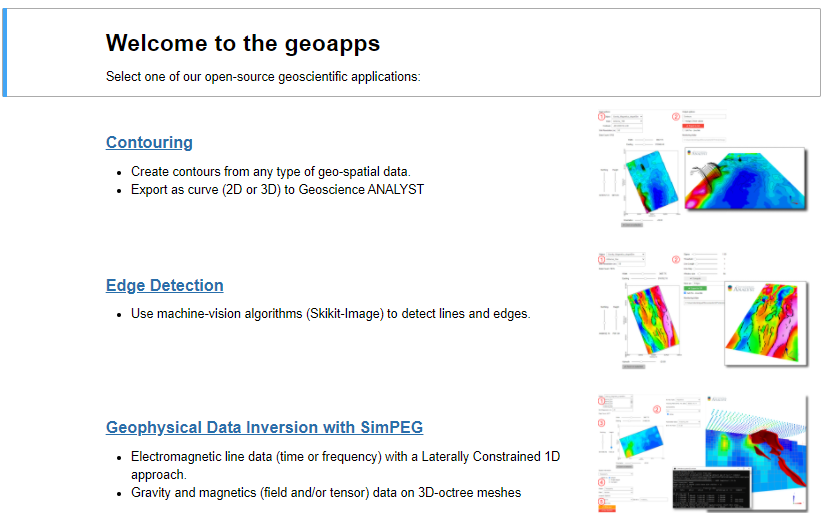

geoapps: Python applications for geoscientific problems
=======================================================
Welcome to **geoapps**! Where geoscientists meet to share open-source applications.



In short
--------

The **geoapps** has been created for the development of open-source
geoscientific applications in Python. Users will be able to directly leverage
the powerful visualization capabilities of `Geoscience ANALYST
<https://mirageoscience.com/mining-industry-software/geoscience-analyst/>`_
along with open-source code from the Python ecosystem.

Links
-----

- [Installation](https://geoapps.readthedocs.io/en/latest/content/installation.html#installation)
- [Documentation](https://geoapps.readthedocs.io/en/latest/index.html)
- Available on PyPI

  ```pip install geoapps```
  
  https://pypi.org/project/geoapps/
