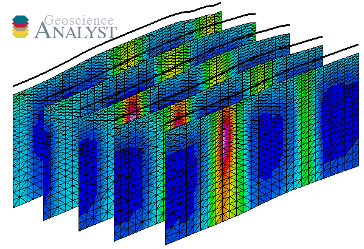
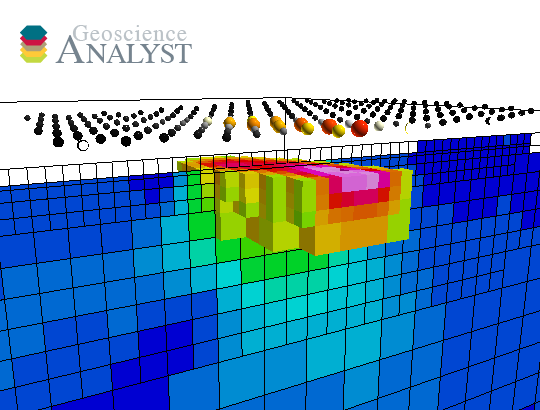
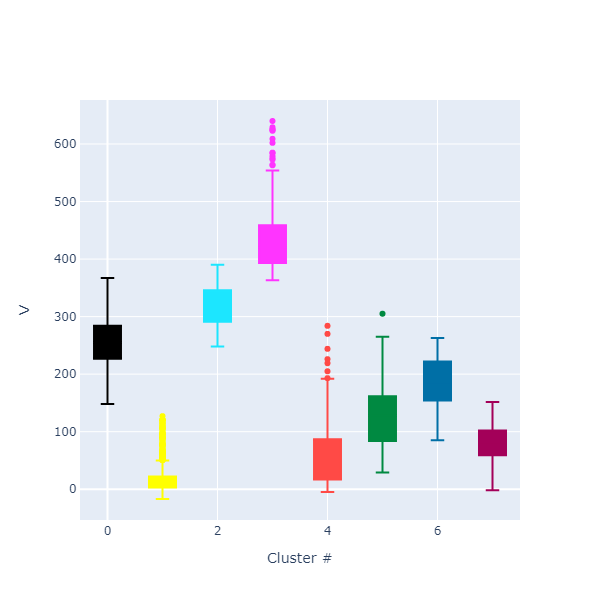
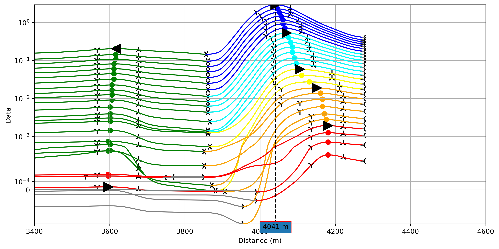
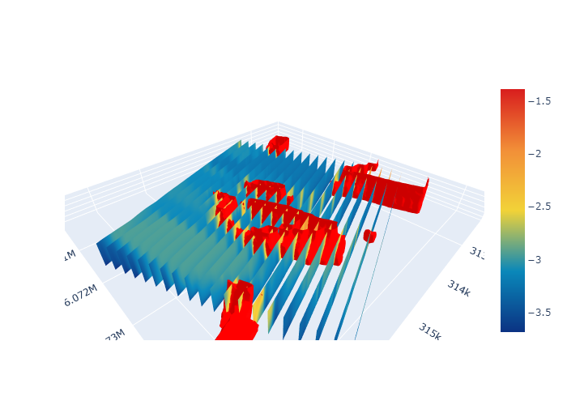

Applications
============

Gallery of applications currently available

Workspace
---------

.. nbgallery::
    :name: base_applications
    :glob:
    :reversed:

    applications/export
    applications/view_selection
    applications/object_data_selection
    applications/base_application

Object/Data Utilities
---------------------

.. nbgallery::
    :name: object_creation
    :glob:
    :reversed:

    applications/calculator
    applications/contouring
    applications/create_surface
    applications/create_isosurface
    applications/create_octree
    applications/coordinate_transformation
    applications/data_interpolation

Machine Learning
----------------

.. nbgallery::
    :name: machine_learning
    :glob:
    :reversed:

    applications/edge_detection
    applications/clustering
    applications/peak_finder

Geophysical Inversion
---------------------

.. nbgallery::
    :name: inversion
    :glob:
    :reversed:

    applications/grav_mag_inversion
    applications/em1d_inversion

Visualization
-------------

.. nbgallery::
    :name: data_viz
    :glob:
    :reversed:

    applications/scatter

Need help? Contact us at support@mirageoscience.com

.. figure:: applications/images/edge_detection_thumbnail.png
    :align: center
    :width: 0

.. figure:: applications/images/export_thumbnail.png
    :align: center
    :width: 0

.. figure:: applications/images/object_selection_thumbnail.png
    :align: center
    :width: 0

.. figure:: applications/images/contours_thumbnail.png
    :align: center
    :width: 0

.. figure:: applications/images/model_surface.png
    :align: center
    :width: 0

.. figure:: applications/images/coordinate_transform_thumbnail.png
    :align: center
    :width: 0

.. figure:: applications/images/calculator_thumbnail.png
    :align: center
    :width: 0

.. figure:: applications/images/data_interp_thumbnail.png
    :align: center
    :width: 0

