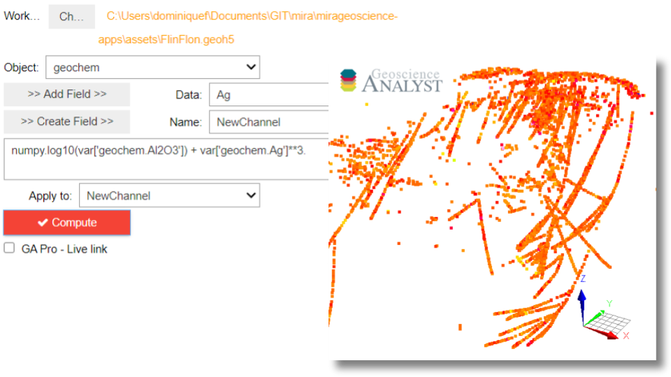

:orphan:

.. _calculator:

Calculator
==========

With this application, users can add or edit data from existing ``Objects`` using simple Python
operations or any function from the `Numpy
<https://numpy.org/doc/stable/reference/index.html>`_ library.

.. note:: Active widgets on this page are for demonstration only.

          The latest version of the application can be `downloaded here <https://github.com/MiraGeoscience/geoapps/archive/develop.zip>`_.

          See the :ref:`Installation page <getting_started>` to get started.

Input Parameters
----------------

Project
^^^^^^^

See :ref:`Project panel <workspaceselection>`

.. jupyter-execute::
    :hide-code:

    from geoapps.processing import Calculator
    app = Calculator(
        h5file=r"../assets/FlinFlon.geoh5",
    )
    app.project_panel

Objects
^^^^^^^

List of objects available to pull data from.

.. jupyter-execute::
    :hide-code:

    from geoapps.processing import Calculator
    from ipywidgets import HBox
    app = Calculator(
          h5file=r"../assets/FlinFlon.geoh5",
    )
    app.objects

Add
^^^

Add the selected data as a variable and append to the scripting window.

.. jupyter-execute::
    :hide-code:

    from geoapps.processing import Calculator
    from ipywidgets import HBox
    app = Calculator(
          h5file=r"../assets/FlinFlon.geoh5",
    )
    HBox([app.data, app.use])

Create
^^^^^^

Add the name as data to the current object. Values of zeros are assigned to the new data by default.

.. jupyter-execute::
    :hide-code:

    from geoapps.processing import Calculator
    from ipywidgets import HBox
    app = Calculator(
          h5file=r"../assets/FlinFlon.geoh5",
    )
    HBox([app.channel, app.add])

Equation
^^^^^^^^

Scripting window used to compute values.

All core Python element-wise operators are accepted: add (``+``), subtract (``-``), multiply
(``*``), divide (``/``), power (``**``). Line breaks between operations can be used
for clarity but must be surrounded by parentheses ().

`Numpy <https://numpy.org/doc/stable/reference/index.html>`_ operations can also be used e.g.: ``numpy.log10(var)`` (log base 10)

.. jupyter-execute::
    :hide-code:

    from geoapps.processing import Calculator
    from ipywidgets import HBox
    app = Calculator(
          h5file=r"../assets/FlinFlon.geoh5",
    )
    app.equation.value = "numpy.log10(var['geochem.Al2O3']) / (var['geochem.CaO']/2 + var['geochem.Cu']**3.)"
    app.equation

Output Parameters
-----------------

Store
^^^^^

Assign the result to the specified data.

.. jupyter-execute::
    :hide-code:

    from geoapps.processing import Calculator
    app = Calculator(
        h5file=r"../assets/FlinFlon.geoh5",
    )
    app.store.data

Compute
^^^^^^^

See :ref:`Trigger panel<trigger_panel>` base applications.

.. jupyter-execute::
    :hide-code:

    from geoapps.processing import Calculator
    app = Calculator(
        h5file=r"../assets/FlinFlon.geoh5",
    )
    app.trigger

.. jupyter-execute::
    :hide-code:

    from geoapps.processing import Calculator
    app = Calculator(
        h5file=r"../assets/FlinFlon.geoh5",
    )
    app.live_link_panel
