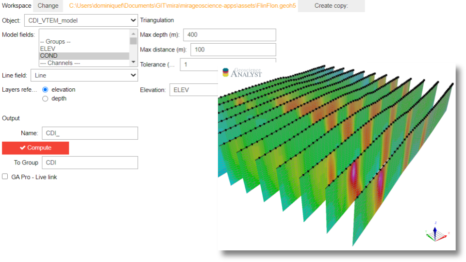

:orphan:

.. _cdi_surface:

CDI to 3D surface
=================

With this application, users can convert CDI ``Curve`` to 3D ``Surface`` objects
for visualization and modeling.

.. note:: The latest version of applications can be `downloaded here <https://github.com/MiraGeoscience/geoapps/archive/develop.zip>`_.

          See the :ref:`Installation page <getting_started>` to get started.

Input data
----------

The following list of interactive widgets are for documentation and demonstration purposes only.

.. list-table::
   :header-rows: 0

   * - .. jupyter-execute::
            :hide-code:

            from geoapps.processing import CDICurve2Surface
            app = CDICurve2Surface(
                h5file=r"../assets/FlinFlon.geoh5",
            )
            app.project_panel

   * - See :ref:`Project panel <workspaceselection>`

.. list-table::
   :header-rows: 0

   * -  .. jupyter-execute::
            :hide-code:

            from geoapps.processing import CDICurve2Surface
            from ipywidgets import HBox
            app = CDICurve2Surface(
                  h5file=r"../assets/FlinFlon.geoh5",
            )
            HBox([app.objects, app.data])

   * - List of objects with corresponding data groups available for transfer to the new ``Surface`` object.

       See :ref:`Object, data selection <objectdataselection>`

Z options
^^^^^^^^^

.. list-table::
   :header-rows: 0

   * -  .. jupyter-execute::
            :hide-code:

            from geoapps.processing import CDICurve2Surface
            from ipywidgets import HBox
            app = CDICurve2Surface(
                  h5file=r"../assets/FlinFlon.geoh5",

            )
            app.z_option.disabled = True
            app.depth_panel

   * - Assign z-coordinates based on ``Elevation`` (m) field provided by the ``Curve`` object.

.. list-table::
   :header-rows: 0

   * -  .. jupyter-execute::
            :hide-code:

            from geoapps.processing import CDICurve2Surface
            from ipywidgets import HBox
            app = CDICurve2Surface(
                  h5file=r"../assets/FlinFlon.geoh5",

            )
            app.z_option.value = "depth"
            app.topography.objects.value = "Topography"
            app.topography.data.value = "Z"
            app.z_option.disabled = True
            app.depth_panel

   * - Assign z-coordinates based on ``Depth`` (m) field provided by the ``Curve`` object.

       The absolute z-coordinate requires topography to be defined by either:
        - A topography ``Object`` with elevation
        - An offset value ``Relative to Sensor`` (curve vertices)
        - A ``Constant`` elevation

Line
^^^^

.. list-table::
   :header-rows: 0

   * -  .. jupyter-execute::
            :hide-code:

            from geoapps.processing import CDICurve2Surface
            from ipywidgets import HBox
            app = CDICurve2Surface(
                  h5file=r"../assets/FlinFlon.geoh5",

            )
            app.lines

   * - Select ``Line`` field identifier to brake up the sections.

Triangulation
^^^^^^^^^^^^^

.. list-table::
   :header-rows: 0

   * -  .. jupyter-execute::
            :hide-code:

            from geoapps.processing import CDICurve2Surface
            from ipywidgets import HBox
            app = CDICurve2Surface(
                  h5file=r"../assets/FlinFlon.geoh5",

            )
            app.max_distance

   * - Maximum triangulation distance allowed during the ``Surface`` creation.
       Useful option for CDI curves with missing values.

Output Parameters
-----------------

.. list-table::
   :header-rows: 0

   * - .. jupyter-execute::
            :hide-code:

            from geoapps.processing import CDICurve2Surface
            app = CDICurve2Surface(
                h5file=r"../assets/FlinFlon.geoh5",
            )
            app.export_as
   * - String value used to name the new ``Surface`` object.

.. list-table::
   :header-rows: 0

   * - .. jupyter-execute::
            :hide-code:

            from geoapps.processing import CDICurve2Surface
            app = CDICurve2Surface(
                h5file=r"../assets/FlinFlon.geoh5",
            )
            app.trigger_panel
   * - See :ref:`Trigger panel<trigger_panel>` base applications.
