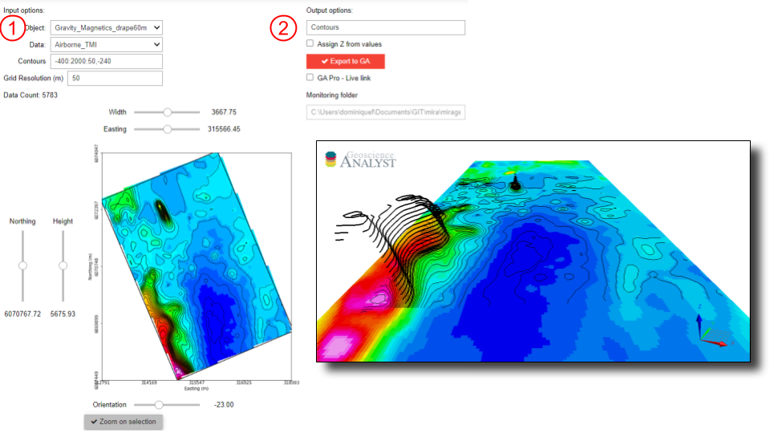

:orphan:

.. _contourApp:

Contouring
==========

With this application, users can create contours from data stored on points,
curves, surfaces or grid objects.  The application uses the `matplotlib
<https://matplotlib.org/>`_ open-source package. The generated contours can be
exported to `Geoscience ANALYST
<https://mirageoscience.com/mining-industry-software/geoscience-analyst/>`_,
either as 2D or 3D curves.

`Video tutorial available on Youtube <https://youtu.be/sjaQzZlm8qQ>`_

.. note:: The latest version of applications can be `downloaded here <https://github.com/MiraGeoscience/geoapps/archive/develop.zip>`_.

          See the :ref:`Installation page <getting_started>` to get started.

          The following list of interactive widgets are for documentation and demonstration purposes only.

Input Parameters
----------------

Project
^^^^^^^

See :ref:`Object, data selection <objectdataselection>`

.. jupyter-execute::
    :hide-code:

    from geoapps.selection import ObjectDataSelection
    ObjectDataSelection(
    select_multiple=True, add_groups=True,
         h5file=r"../assets/FlinFlon.geoh5",
         objects="Data_FEM_pseudo3D",
    ).widget

Contours
^^^^^^^^

Numerical values or range of values to draw contours:

  *-400:2000:50*: Draws contours between -400 to 2000 for every 50 increment

  *-240*: Draws contours at value -240

  *-400:2000:50, -240*: Any combination of the above, in any order...

.. jupyter-execute::
    :hide-code:

    from geoapps.processing import ContourValues
    app = ContourValues(
        h5file=r"../assets/FlinFlon.geoh5",
        contours="-400:100:2000, -240"
    )
    app.contours

2D Plot
^^^^^^^

See :ref:`Plot and select data <plotselectiondata>`

.. jupyter-execute::
    :hide-code:

    from geoapps.plotting import PlotSelection2D
    app = PlotSelection2D(
      h5file=r"../assets/FlinFlon.geoh5",
    )
    app.widget

Output Parameters
-----------------

Name
^^^^

String value used as name of contours added to the ``geoh5`` project.

.. jupyter-execute::
    :hide-code:

    from geoapps.processing import ContourValues
    app = ContourValues(
        h5file=r"../assets/FlinFlon.geoh5",
    )
    app.export_as

Assign Z
^^^^^^^^

Option to export contours with Z (elevation) based on data values.

[Default] Contours are linearly draped on the object vertices.

.. jupyter-execute::
    :hide-code:

    from geoapps.processing import ContourValues
    app = ContourValues(
        h5file=r"../assets/FlinFlon.geoh5",
    )
    app.z_value

Export panel
^^^^^^^^^^^^

See :ref:`Trigger panel<trigger_panel>` base applications.

.. jupyter-execute::
    :hide-code:

    from geoapps.processing import ContourValues
    app = ContourValues(
        h5file=r"../assets/FlinFlon.geoh5",
    )
    app.trigger_panel
