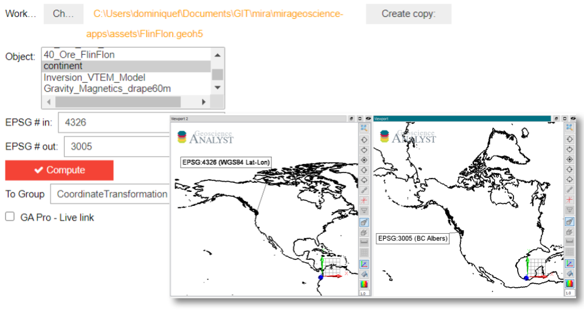

:orphan:

.. _Coordinate_transformation:

Coordinate Transformation
=========================

This application lets users export objects and data from a ``geoh5`` to
various open file formats.

.. note:: The latest version of applications can be `downloaded here <https://github.com/MiraGeoscience/geoapps/archive/develop.zip>`_.

          See the :ref:`Installation page <getting_started>` to get started.

          The following list of interactive widgets are for documentation and demonstration purposes only.

Input Parameters
----------------

Project
^^^^^^^

See :ref:`Project panel <workspaceselection>`

.. jupyter-execute::
    :hide-code:

    from geoapps.processing import CoordinateTransformation
    app = CoordinateTransformation(
        h5file=r"../assets/FlinFlon.geoh5"
    )
    app.project_panel

Objects
^^^^^^^

List of objects available for reprojection.

.. jupyter-execute::
            :hide-code:

            from geoapps.processing import CoordinateTransformation
            from ipywidgets import HBox
            app = CoordinateTransformation(
                  h5file=r"../assets/FlinFlon.geoh5"
            )
            app.objects

Input EPSG
^^^^^^^^^^

`EPSG code <https://spatialreference.org/ref/epsg/>`_ describing the current object coordinate system.

.. jupyter-execute::
    :hide-code:

    from geoapps.processing import CoordinateTransformation
    from ipywidgets import HBox
    app = CoordinateTransformation(
          h5file=r"../assets/FlinFlon.geoh5"
    )
    app.epsg_in

Output
^^^^^^

`EPSG code <https://spatialreference.org/ref/epsg/>`_ describing the new coordinate system.

.. jupyter-execute::
    :hide-code:

    from geoapps.processing import CoordinateTransformation
    from ipywidgets import HBox
    app = CoordinateTransformation(
          h5file=r"../assets/FlinFlon.geoh5"
    )
    app.epsg_out

Output Parameters
-----------------

See :ref:`Trigger Panel <trigger_panel>` documentation.

.. jupyter-execute::
    :hide-code:

    from geoapps.processing import CoordinateTransformation
    from ipywidgets import HBox
    app = CoordinateTransformation(
          h5file=r"../assets/FlinFlon.geoh5"
    )
    app.trigger_panel
