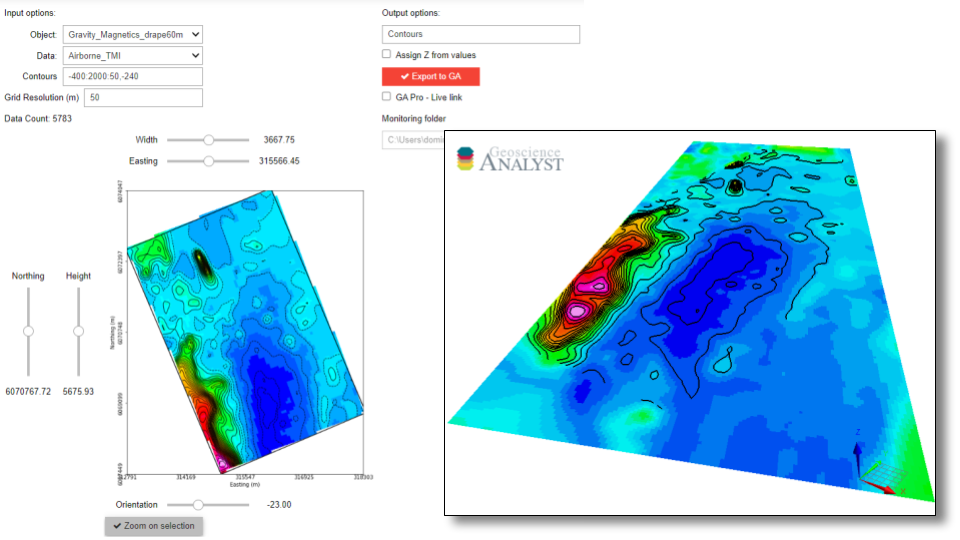

Create contours
===============

With this application, users can create contours from data using the
`matplotlib <https://scikit-image.org/>`_ open-source package.

- The contouring can be done on points, curves, surfaces and grids.
- Contours can be exported to `Geoscience ANALYST <https://mirageoscience.com/mining-industry-software/geoscience-analyst/>`_, either as 2D or 3D curves.

`Video tutorial available on Youtube <https://youtu.be/sjaQzZlm8qQ>`_

**1- Input parameters**

.. list-table::
   :header-rows: 0

   * - .. jupyter-execute::
            :hide-code:

            from geoapps.processing import ContourValues
            app = ContourValues(
                h5file=r"../assets/FlinFlon.geoh5",
                objects="Gravity_Magnetics_drape60m",
                data='Airborne_TMI',
            )
            app.plot_selection.selection.widget
   * - See :ref:`Object, data selection <objectdataselection>`

.. list-table::
   :header-rows: 0

   * - .. jupyter-execute::
            :hide-code:

            from geoapps.processing import ContourValues
            app = ContourValues(
                h5file=r"../assets/FlinFlon.geoh5",
                contours="-400:100:2000, -240"
            )
            app.contours
   * - Numerical values or range of values to draw contours:

        *-400:2000:50*: Draws contours between -400 to 2000 for every 50 increment

        *-240*: Draws contours at value -240

        *-400:2000:50, -240*: Any combination of the above, in any order...

.. list-table::
   :header-rows: 0

   * - .. jupyter-execute::
            :hide-code:

            from geoapps.processing import ContourValues
            app = ContourValues(
                h5file=r"../assets/FlinFlon.geoh5",
                objects="Gravity_Magnetics_drape60m",
                data='Airborne_TMI',
            )
            app.plot_selection.plot_widget
   * - See :ref:`Plot and select data <plotselectiondata>`

**2- Output Parameters**

.. list-table::
   :header-rows: 0

   * - .. jupyter-execute::
            :hide-code:

            from geoapps.processing import ContourValues
            app = ContourValues(
                h5file=r"../assets/FlinFlon.geoh5",
            )
            app.export_as
   * - String value used as name of contours added to the ``geoh5`` project.

.. list-table::
   :header-rows: 0

   * - .. jupyter-execute::
            :hide-code:

            from geoapps.processing import ContourValues
            app = ContourValues(
                h5file=r"../assets/FlinFlon.geoh5",
            )
            app.z_value
   * - Contours will be exported with Z (elevation) based on value of contours.

       Otherwise, contours are linearly draped on the object vertices.

.. list-table::
   :header-rows: 0

   * - .. jupyter-execute::
            :hide-code:

            from geoapps.processing import ContourValues
            app = ContourValues(
                h5file=r"../assets/FlinFlon.geoh5",
            )
            app.trigger_widget
   * - Triggers write to ``geoh5``

       [OPTIONAL] **Live link (For ANALYST-Pro users)**

       Specify a path for the monitoring folder for live updates.
