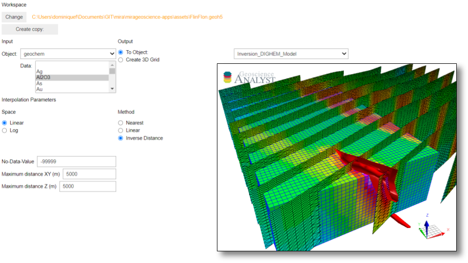

:orphan:

.. _dataInterpolation:

Data Interpolation
==================

This application lets users transfer data from one object to another.
Alternatively, users can generate a uniform grid (BlockModel) to transfer
data/models at a set resolution and extant.

.. note:: The latest version of applications can be `downloaded here <https://github.com/MiraGeoscience/geoapps/archive/develop.zip>`_.

          See the :ref:`Installation page <getting_started>` to get started.

          The following list of interactive widgets are for documentation and demonstration purposes only.

Input Parameters
----------------

Project
^^^^^^^

.. jupyter-execute::
    :hide-code:

    from geoapps.processing import DataInterpolation
    app = DataInterpolation(
        h5file=r"../assets/FlinFlon.geoh5"
    )
    app.project_panel

See :ref:`Project panel <workspaceselection>`

Source Object/Data
^^^^^^^^^^^^^^^^^^

.. jupyter-execute::
    :hide-code:

    from geoapps.processing import DataInterpolation
    from ipywidgets import VBox
    app = DataInterpolation(
          h5file=r"../assets/FlinFlon.geoh5",
    )
    VBox([app.objects, app.data])

List of objects with corresponding data groups available for transfer to the
neighboring object.

See :ref:`Object, data selection <objectdataselection>`

Destination
^^^^^^^^^^^

Object to transfer data onto.

To Object
"""""""""

.. jupyter-execute::
    :hide-code:

    from geoapps.processing import DataInterpolation
    app = DataInterpolation(
          h5file=r"../assets/FlinFlon.geoh5",
    )
    app.out_mode.value = "To Object"
    app.out_mode.disabled = True
    app.out_panel

List of objects available in the target ``geoh5``.

Create 3D Grid
""""""""""""""

.. jupyter-execute::
    :hide-code:

    from geoapps.processing import DataInterpolation
    app = DataInterpolation(
          h5file=r"../assets/FlinFlon.geoh5",
    )
    app.out_mode.value = "Create 3D Grid"
    app.out_mode.disabled = True
    app.out_panel

Create a new ``BlockModel`` object to transfer data onto. Useful for merging
EM1D inversion results.

- **Name**: Name assigned to the new ``BlockModel`` object.
- **Lateral Extent**: Use an object (usually the ``Source`` object) to determine the horizontal extent of the new grid.
- **Smallest cells**: Grid cell size (m) along the x, y and z-axis.
- **Core depth**: Depth of the grid using the smallest cell size.
- **Pad Distance**: Add padding cells outside the core region. Requires six values of distances (m) along: [West, East, North, South, Down and Up]
- **Expansion Factor**: If padding distances are used, the rate of expansion of those cells where: :math:`h_x = h_0 * \alpha^{[0, 1, ..., N_c]}`

Interpolation Parameters
------------------------

.. jupyter-execute::
    :hide-code:

    from geoapps.processing import DataInterpolation
    app = DataInterpolation(
          use_defaults=False
    )
    app.parameter_choices

List of additional parameters controlling the interpolation.

Method
^^^^^^

.. jupyter-execute::
    :hide-code:

    from geoapps.processing import DataInterpolation
    app = DataInterpolation(
          use_defaults=False
    )
    app.method

Interpolation methods
"""""""""""""""""""""

- **Nearest**: (Fastest) Use the nearest neighbors between the ``Source`` and ``Destination`` objects (vertices or centroids). Uses `Scipy.spatial.cKDTree <https://docs.scipy.org/doc/scipy/reference/generated/scipy.spatial.cKDTree.html>`_
- **Linear**: (Slowest) Use a Delaunay triangulation from `Scipy.interpolate.LinearNDInterpolator <https://docs.scipy.org/doc/scipy/reference/generated/scipy.interpolate.LinearNDInterpolator.html>`_
- **Inverse Distance**: Weighted averaging using 8 nearest neighbors:

  :math:`val = \frac{\sum_{i=1}^8 val_i * r_i^{-1}}{\sum_{i=1}^8 r_i^{-1}}`

  where :math:`r_i` is the radial distance between a vertex/centroid to its :math:`i^{th}` nearest neighbor.

  .. jupyter-execute::
    :hide-code:

    from geoapps.processing import DataInterpolation
    app = DataInterpolation(
          use_defaults=False
    )
    app.method_skew

  Optional skew parameters available to deal with elongated ``Source``
   - *Azimuth*: Angle (degree) from North of ``Source`` object orientation.
   - *Factor*: Aspect ratio between the in-line spacing and the line separation  (i.e. 25 m stations / 100 line spacing => 0.25)

Scaling
^^^^^^^

.. jupyter-execute::
    :hide-code:

    from geoapps.processing import DataInterpolation
    app = DataInterpolation(
          use_defaults=False
    )
    app.space

- **Linear**: Values interpolated in linear-space.
- **Log**: Values converted to log-space before interpolation. The result is converted back to its original space (signed) after transfer. Useful for data values spanning multiple order of magnitude such as resistivity.

Horizontal Extent
^^^^^^^^^^^^^^^^^

Add limits to the horizontal extrapolation of the data.

Object hull
"""""""""""

.. jupyter-execute::
    :hide-code:

    from geoapps.processing import DataInterpolation
    from ipywidgets import VBox
    app = DataInterpolation(
          use_defaults=False
    )
    app.xy_extent

Use radial distance from an object vertices or centroids.

Max distance
""""""""""""

.. jupyter-execute::
    :hide-code:

    from geoapps.processing import DataInterpolation
    from ipywidgets import VBox
    app = DataInterpolation(
          use_defaults=False
    )
    app.max_distance

Set the maximum extrapolation distance (m).

Vertical Extent
^^^^^^^^^^^^^^^

Add limits to the vertical extrapolation of the data.

Topography
""""""""""

.. jupyter-execute::
    :hide-code:

    from geoapps.processing import DataInterpolation
    from ipywidgets import VBox
    app = DataInterpolation(
          use_defaults=False
    )
    app.topography.widget

Define the upper boundary from topography.
See the :ref:`Topography <topo_widget>` widget for details.

Max depth
"""""""""

.. jupyter-execute::
    :hide-code:

    from geoapps.processing import DataInterpolation
    from ipywidgets import VBox
    app = DataInterpolation(
          use_defaults=False
    )
    app.max_depth

Set the maximum depth (vertical distance below ``Source``) to extrapolate data.

.. - Choose an object and associated data
.. - Pick a destination object or create a 3D grid
.. - Select the ``Space`` to use for interpolation:
..  - ``Linear``
..  - ``Log``
.. - Select the ``Method``
..  - ``Nearest``: Nearest neighbour interpolation using [scipy.spatial.cKDTree](https://docs.scipy.org/doc/scipy/reference/generated/scipy.spatial.cKDTree.html) (Fastest)
..  - ``Linear``: Linear interpolation from [scipy.interpolate.LinearNDInterpolator](https://docs.scipy.org/doc/scipy/reference/generated/scipy.interpolate.LinearNDInterpolator.html) (Slowest)
..  - ``Inverse Distance``:
..    - Azimuth (lines orientation angle from North)
..    - Factor (ratio between along vs cross line distance)
..      - e.g.: For EW orientation @ 200 m line spacing and stations 25 m apart. Use -> Azimuth: 90, Factor: 0.125 (25/200)
.. - Interpolate your data/model !
