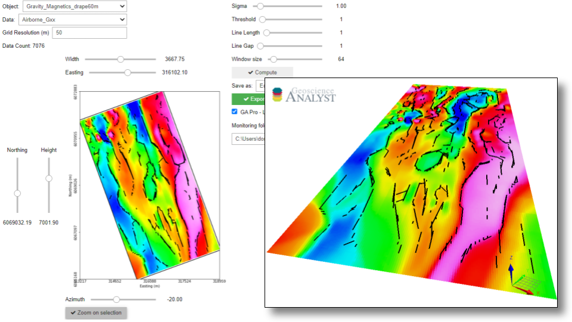

:orphan:

.. _edgeDetection:

Edge Detection
==============

With this application, users can create lines along edges (lineaments) from gridded data in a
semi-automated fashion. The application uses machine vision algorithms from the `Scikit-Image
<https://scikit-image.org/>`_ open-source package.

- Currently available for Grid2D objects.
- Edges can be exported to `Geoscience ANALYST <https://mirageoscience.com/mining-industry-software/geoscience-analyst/>`_ for viewing and editing.
- See Methodology_ for algorithmic details

`Video tutorial available on Youtube <https://youtu.be/Lpn3xA7xlBs>`_

.. note:: The latest version of applications can be `downloaded here <https://github.com/MiraGeoscience/geoapps/archive/develop.zip>`_.

          See the :ref:`Installation page <getting_started>` to get started.

Input data
----------

The following list of interactive widgets are for documentation and demonstration purposes only.

.. list-table::
   :header-rows: 0

   * - .. jupyter-execute::
            :hide-code:

            from geoapps.selection import ObjectDataSelection
            ObjectDataSelection(
            select_multiple=True, add_groups=True,
                 h5file=r"../assets/FlinFlon.geoh5",
                 objects="Data_FEM_pseudo3D",
            ).widget
   * - See :ref:`Object, data selection <objectdataselection>`

.. list-table::
   :header-rows: 0

   * - .. jupyter-execute::
            :hide-code:

            from geoapps.plotting import PlotSelection2D
            app = PlotSelection2D(
              h5file=r"../assets/FlinFlon.geoh5",
            )
            app.widget
   * - See :ref:`Plot and select data <plotselectiondata>`

Detection Parameters
--------------------

Parameter for the Canny_ edge detection.

.. list-table::
   :header-rows: 0

   * - .. jupyter-execute::
            :hide-code:

            from geoapps.processing import EdgeDetectionApp
            app = EdgeDetectionApp(
                h5file=r"../assets/FlinFlon.geoh5",
            )
            app.sigma
   * - Standard deviation of the Gaussian filter used in the Canny algorithm.

Parameters controling the `Hough Line Transform`_

.. list-table::
   :header-rows: 0

   * - .. jupyter-execute::
            :hide-code:

            from geoapps.processing import EdgeDetectionApp
            app = EdgeDetectionApp(
                h5file=r"../assets/FlinFlon.geoh5",
            )
            app.threshold

.. list-table::
   :header-rows: 0

   * - .. jupyter-execute::
            :hide-code:

            from geoapps.processing import EdgeDetectionApp
            app = EdgeDetectionApp(
                h5file=r"../assets/FlinFlon.geoh5",
            )
            app.line_length

   * - Minimum accepted pixel length of detected lines

.. list-table::
   :header-rows: 0

   * - .. jupyter-execute::
            :hide-code:

            from geoapps.processing import EdgeDetectionApp
            app = EdgeDetectionApp(
                h5file=r"../assets/FlinFlon.geoh5",
            )
            app.line_gap

   * - Maximum gap between pixels to still form a line.

.. _window size:

.. list-table::
   :header-rows: 0

   * - .. jupyter-execute::
            :hide-code:

            from geoapps.processing import EdgeDetectionApp
            app = EdgeDetectionApp(
                h5file=r"../assets/FlinFlon.geoh5",
            )
            app.window_size

   * - Maximum window size (square).

*Output*

.. list-table::
   :header-rows: 0

   * - .. jupyter-execute::
            :hide-code:

            from geoapps.processing import EdgeDetectionApp
            app = EdgeDetectionApp(
                h5file=r"../assets/FlinFlon.geoh5",
            )
            app.trigger_panel
   * - See :ref:`Trigger panel<trigger_panel>` base applications.

.. _methodology:

Methodology
-----------

The conversion from raster data to lines involves the following four main processing steps.

.. figure:: ./images/edge_detection_algo.png
        :align: center
        :alt: inv_app

1. The selected gridded data are normalized between [0, 1]

2. Normalized values are processed with the Canny_ edge detection algorithm.

3. The full grid is sub-divided into overlapping square tiles defined by the
   `window size`_ parameter. Tiling is used to speed up computations and reduce
   skews in the Hough line parametrization observed on grids with small aspect ratios.

4. For each tile, edges are converted to a line parametric form using the `Hough Line Transform`_.

.. _Canny: https://scikit-image.org/docs/dev/auto_examples/edges/plot_canny.html#sphx-glr-auto-examples-edges-plot-canny-py

.. _Hough Line Transform: https://scikit-image.org/docs/dev/api/skimage.transform.html#probabilistic-hough-line
