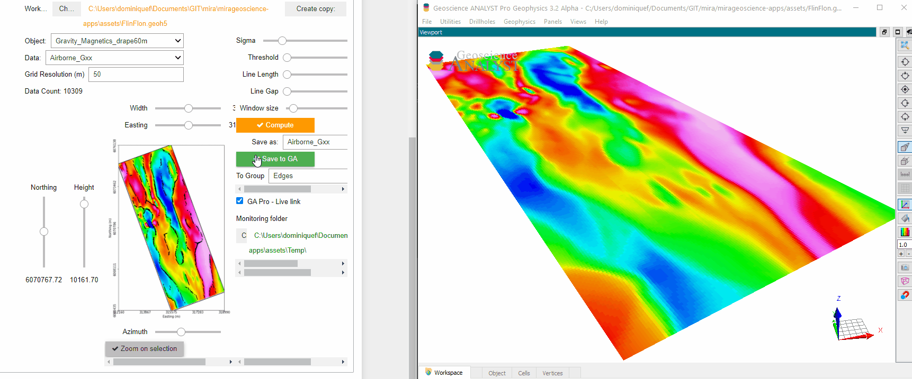
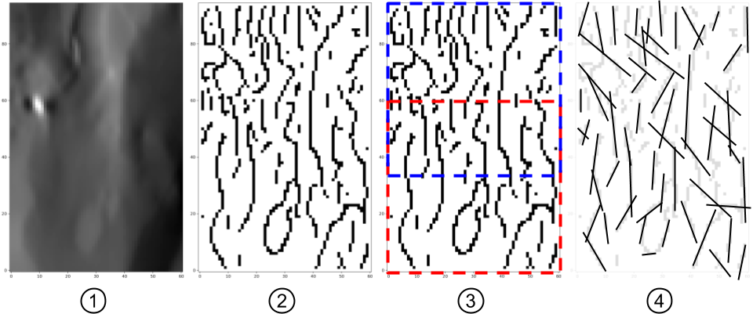

:orphan:

.. _edgeDetection:

Edge Detection
==============

With this application, users can create lines along edges (lineaments) from gridded data in a
semi-automated fashion. The application uses machine vision algorithms from the `Scikit-Image
<https://scikit-image.org/>`_ open-source package.

- Currently available for Grid2D objects.
- Edges can be exported to `Geoscience ANALYST <https://mirageoscience.com/mining-industry-software/geoscience-analyst/>`_ for viewing and editing.
- See Methodology_ for algorithmic details

`Video tutorial available on Youtube <https://youtu.be/Lpn3xA7xlBs>`_

.. note:: Active widgets on this page are for demonstration only.

          The latest version of the application can be `downloaded here <https://github.com/MiraGeoscience/geoapps/archive/develop.zip>`_.

          See the :ref:`Installation page <getting_started>` to get started.

Input data
----------

Object and data
^^^^^^^^^^^^^^^

Select a ``Grid2D`` and associated data (see :ref:`Object, data selection <objectdataselection>`)

.. jupyter-execute::
    :hide-code:

    from geoapps.selection import ObjectDataSelection
    ObjectDataSelection(
    select_multiple=True, add_groups=True,
         h5file=r"../assets/FlinFlon.geoh5",
         objects="Data_FEM_pseudo3D",
    ).widget

Windowing
^^^^^^^^^

See :ref:`Plot and select data <plotselectiondata>`

.. jupyter-execute::
    :hide-code:

    from geoapps.plotting import PlotSelection2D
    app = PlotSelection2D(
      h5file=r"../assets/FlinFlon.geoh5",
    )
    app.widget

Canny Edge Parameters
---------------------

See Canny_ edge detection documentation.

Sigma
^^^^^

Standard deviation of the Gaussian filter used in the Canny algorithm.

.. jupyter-execute::
    :hide-code:

    from geoapps.processing import EdgeDetectionApp
    app = EdgeDetectionApp(
        h5file=r"../assets/FlinFlon.geoh5",
    )
    app.sigma

Hough Line Parameters
---------------------

See `Hough Line Transform`_ documention.

Treshold
^^^^^^^^

Detection threshold

.. jupyter-execute::
    :hide-code:

    from geoapps.processing import EdgeDetectionApp
    app = EdgeDetectionApp(
        h5file=r"../assets/FlinFlon.geoh5",
    )
    app.threshold

Line length
^^^^^^^^^^^

Filter for the minimum length (pixels) of detected lines.

.. jupyter-execute::
    :hide-code:

    from geoapps.processing import EdgeDetectionApp
    app = EdgeDetectionApp(
        h5file=r"../assets/FlinFlon.geoh5",
    )
    app.line_length

Line Gap
^^^^^^^^

Maximum gap between pixels to still form a line.

.. jupyter-execute::
    :hide-code:

    from geoapps.processing import EdgeDetectionApp
    app = EdgeDetectionApp(
        h5file=r"../assets/FlinFlon.geoh5",
    )
    app.line_gap

.. _window size:

Window Size
^^^^^^^^^^^

Window size (square) used for the tiling of the data (see :ref:`Methodology <methodology>`)

.. jupyter-execute::
    :hide-code:

    from geoapps.processing import EdgeDetectionApp
    app = EdgeDetectionApp(
        h5file=r"../assets/FlinFlon.geoh5",
    )
    app.window_size

Output
------

See :ref:`Trigger panel<trigger_panel>` base applications.

.. jupyter-execute::
    :hide-code:

    from geoapps.processing import EdgeDetectionApp
    app = EdgeDetectionApp(
        h5file=r"../assets/FlinFlon.geoh5",
    )
    app.trigger_panel

.. _methodology:

Methodology
-----------

The conversion from raster data to lines involves the following four main processing steps.

1. The selected gridded data are normalized between [0, 1]

2. Normalized values are processed with the Canny_ edge detection algorithm.

3. The full grid is sub-divided into overlapping square tiles defined by the
   `window size`_ parameter. Tiling is used to speed up computations and reduce
   skews in the Hough line parametrization observed on grids with small aspect ratios.

4. For each tile, edges are converted to a line parametric form using the `Hough Line Transform`_.

.. _Canny: https://scikit-image.org/docs/dev/auto_examples/edges/plot_canny.html#sphx-glr-auto-examples-edges-plot-canny-py

.. _Hough Line Transform: https://scikit-image.org/docs/dev/api/skimage.transform.html#probabilistic-hough-line
