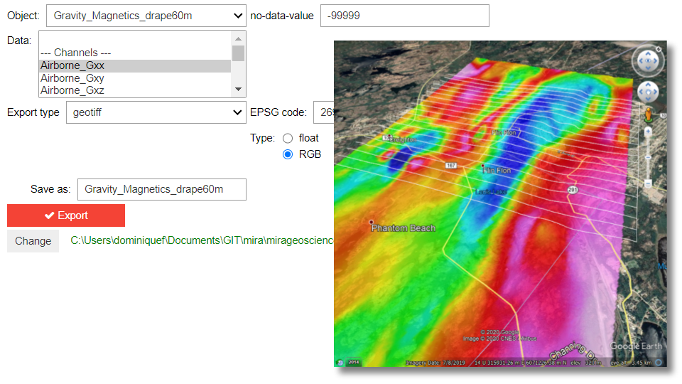

:orphan:

.. _export:

Export
======

This application lets users export objects and data from a ``geoh5`` to
various open file formats.

.. note:: The latest version of applications can be `downloaded here <https://github.com/MiraGeoscience/geoapps/archive/develop.zip>`_.

          See the :ref:`Installation page <getting_started>` to get started.

Input data
----------

The following list of interactive widgets are for documentation and demonstration purposes only.

.. list-table::
   :header-rows: 0

   * - .. jupyter-execute::
            :hide-code:

            from geoapps.export import Export
            app = Export(
                h5file=r"../assets/FlinFlon.geoh5"
            )
            app.project_panel

   * - See :ref:`Project panel <workspaceselection>`

.. list-table::
   :header-rows: 0

   * -  .. jupyter-execute::
            :hide-code:

            from geoapps.export import Export
            from ipywidgets import HBox
            app = Export(
                  h5file=r"../assets/FlinFlon.geoh5"
            )
            HBox([app.objects, app.data])

   * - List of objects and data available for export.

Output Parameters
-----------------

.. list-table::
   :header-rows: 0

   * -  .. jupyter-execute::
            :hide-code:

            from geoapps.export import Export
            from ipywidgets import HBox
            app = Export(
                  h5file=r"../assets/FlinFlon.geoh5"
            )
            app.file_type

   * - List of file formats currently supported.

ESRI Shapefile (``Points``, ``Curve``)
^^^^^^^^^^^^^^^^^^^^^^^^^^^^^^^^^^^^^^

.. list-table::
   :header-rows: 0

   * -  .. jupyter-execute::
            :hide-code:

            from geoapps.export import Export
            from ipywidgets import HBox
            app = Export(
                  h5file=r"../assets/FlinFlon.geoh5"
            )
            app.file_type.value = "ESRI shapefile"
            app.file_type.disabled = True
            app.type_widget

   * - Export option to **.shp**. Z-coodinate is ignored.

       ``EPSG code``: Coordinate system assigned to the shapefile (`Spatial Reference <https://spatialreference.org/ref/epsg/>`_).

Column value (All)
^^^^^^^^^^^^^^^^^^

.. list-table::
   :header-rows: 0

   * -  .. jupyter-execute::
            :hide-code:

            from geoapps.export import Export
            from ipywidgets import HBox
            app = Export(
                  h5file=r"../assets/FlinFlon.geoh5"
            )
            app.file_type.value = "csv"
            app.file_type.disabled = True
            app.type_widget

   * - Export option to **csv**. The x, y and z coordinates of every nodes/cells are appended to the list of data by default.

Geotiff (``Grid2D``)
^^^^^^^^^^^^^^^^^^^^

.. list-table::
   :header-rows: 0

   * -  .. jupyter-execute::
            :hide-code:

            from geoapps.export import Export
            from ipywidgets import HBox
            app = Export(
                  h5file=r"../assets/FlinFlon.geoh5"
            )
            app.file_type.value = "geotiff"
            app.file_type.disabled = True
            app.type_widget

   * - Export option to **.geotiff**.
        - ``EPSG code``: Coordinate system assigned to the shapefile (`Spatial Reference <https://spatialreference.org/ref/epsg/>`_).
        - ``Type``: Type of geotiff exported
           - ``Float``: Single-band image containing the float value of selected data.
           - ``RGB``: 3-band image containing the RGB color displayed in ANALYST.

UBC format (``BlockModel``, ``Octree``)
^^^^^^^^^^^^^^^^^^^^^^^^^^^^^^^^^^^^^^^

.. list-table::
   :header-rows: 0

   * -  .. jupyter-execute::
            :hide-code:

            from geoapps.export import Export
            from ipywidgets import HBox
            app = Export(
                  h5file=r"../assets/FlinFlon.geoh5"
            )
            app.file_type.value = "UBC format"
            app.file_type.disabled = True
            app.type_widget

   * - Export option to UBC mesh (**.msh**) and model (**.mod**) format.

.. list-table::
   :header-rows: 0

   * - .. jupyter-execute::
            :hide-code:

            from geoapps.export import Export
            app = Export(
                h5file=r"../assets/FlinFlon.geoh5"
            )
            app.trigger
   * - Export trigger button.

.. list-table::
   :header-rows: 0

   * - .. jupyter-execute::
            :hide-code:

            from geoapps.export import Export
            app = Export(
                h5file=r"../assets/FlinFlon.geoh5"
            )
            app.live_link_path
   * - Set export directory.
