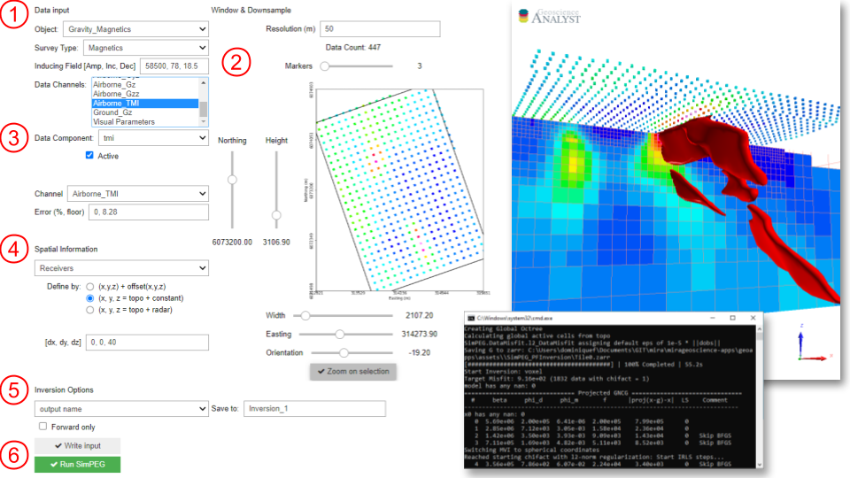

Geophysical inversion (SimPEG)
==============================

This application lets users invert geophysical data with the open-source
`SimPEG <https://simpeg.xyz/>`_ inversion framework. The application currently
supports:

- Gravity and magnetic (field and/or tensor) data on Octree mesh
- Electromagnetic (time or frequency) line data. Inverted with Laterally Constrained 1D algorithm.

More details for the different menu options are provided below.

**Input parameters**

.. list-table::
   :header-rows: 1

   * - **1- Input Data**
     - **Object and data fields selection**
   * -  .. jupyter-execute::
            :hide-code:

            from geoapps.functions.inversion import ObjectDataOptions
            ObjectDataOptions(
                 r"../geoapps/assets/FlinFlon.geoh5",
                 objects="Data_FEM_pseudo3D"
            ).objects
     - List of objects present in the target geoh5 file.
   * -  .. jupyter-execute::
            :hide-code:

            from geoapps.functions.inversion import ObjectDataOptions
            widget = ObjectDataOptions(
                 r"../geoapps/assets/FlinFlon.geoh5",
                 objects="Data_FEM_pseudo3D"
            ).data_channels
            widget.value = ["CPI900"]
            widget
     - List of data and groups stored in the selected *Groups/Data* field.

       The selected data are used to populate **2- Data Components**
   * -  .. jupyter-execute::
            :hide-code:

            from geoapps.functions.inversion import inversion_widgets
            inversion_widgets(r"../geoapps/assets/FlinFlon.geoh5", system="DIGHEM")['system']
     - List of available survey types.

       The application will attempt to assign the *Survey Type* based on

       known *Groups/Data* fields (e.g. *CPI* => *DIGHEM*).
   * -  .. jupyter-execute::
            :hide-code:

            from geoapps.functions.inversion import inversion_widgets
            inversion_widgets(
                r"../geoapps/assets/FlinFlon.geoh5",
                inducing_field="58500, 78, 18.5"
            )["inducing_field"]

        *(Magnetics only)*
     - Inducing field parameters *[nT, dd.dd, dd.dd]*

.. list-table::
   :header-rows: 1

   * - **2- Data Components**
     - **Set individual data channel parameters**
   * -  .. jupyter-execute::
            :hide-code:

            from geoapps.functions.inversion import ChannelOptions
            app = ChannelOptions("DIGHEM", "Frequency (Hz)")
            app.active.value=True
            app.active
     - Checked if the channel is to be used in the inversion
   * -  .. jupyter-execute::
            :hide-code:

            from geoapps.functions.inversion import ChannelOptions
            app = ChannelOptions("DIGHEM", "Frequency (Hz)")
            app.label.value = "900"
            app.label

        *(EM only)*
     - The frequency or time gate for this channel
   * -  .. jupyter-execute::
            :hide-code:

            from geoapps.functions.inversion import ChannelOptions
            app = ChannelOptions("DIGHEM", "Frequency (Hz)")
            app.channel_selection.options = ["CPI56k", "CPI7000", "CPI900", "CPQ56k", "CPQ7000", "CPQ900"]
            app.channel_selection.value  = "CPI900"
            app.channel_selection
     - The list of available data channels expected by the *Survey Type*.
   * -  .. jupyter-execute::
            :hide-code:

            from geoapps.functions.inversion import ChannelOptions
            app = ChannelOptions("DIGHEM", "Frequency (Hz)")
            app.uncertainties.value="0, 4"
            app.uncertainties
     - Uncertainties applied to this channel: *% x abs(data) + floor*
   * -  .. jupyter-execute::
            :hide-code:

            from geoapps.functions.inversion import ChannelOptions, ObjectDataOptions
            app = ChannelOptions("DIGHEM", "Frequency (Hz)")
            app.offsets.value="8, 0, 0"
            app.offsets

        *(EM only)*
     - Offsets (m) between the receiver with respect to the transmitter center location.

.. list-table::
   :header-rows: 1

   * - **4- Spatial Information**
     - **Define the 3D geometry of the survey**
   * - **Topography**
     - Defines the discrete air/ground interface.
   * -  .. jupyter-execute::
            :hide-code:

            from geoapps.functions.inversion import TopographyOptions
            app = TopographyOptions(
                r"../geoapps/assets/FlinFlon.geoh5",
                objects="Topography", value="Vertices"
            )
            app.options_button.value="Object"
            app.options_button.disabled=True
            app.widget

     - Topography defined by an object x,y location and data z-data value.

       The option *Vertices* refers to the nodes of a ``Points``, ``Curve`` or ``Surface`` object.
   * -  .. jupyter-execute::
            :hide-code:

            from geoapps.functions.inversion import TopographyOptions
            app = TopographyOptions(
                r"../geoapps/assets/FlinFlon.geoh5",
                objects="Topography", value="Vertices"
            )
            app.options_button.value="Drape Height"
            app.options_button.disabled=True
            app.offset.value = -40
            app.widget

     - Topography defined by the ``Receiver`` [x, y, z] locations and z-drape value (-below).
   * -  .. jupyter-execute::
            :hide-code:

            from geoapps.functions.inversion import TopographyOptions
            app = TopographyOptions(
                r"../geoapps/assets/FlinFlon.geoh5",
                objects="Topography", value="Vertices"
            )
            app.options_button.value="Constant"
            app.options_button.disabled=True
            app.widget

     - Topography defined by the ``Receiver`` [x, y] locations at constant elevation (m).
   * - **Receiver**
     - Defines the sensor position in 3D space.
   * -  .. jupyter-execute::
            :hide-code:

            from geoapps.functions.inversion import ObjectDataOptions, SensorOptions
            h5file = r"../geoapps/assets/FlinFlon.geoh5"
            obj = ObjectDataOptions(
                 h5file,
                 objects="Data_FEM_pseudo3D"
            ).objects
            app = SensorOptions(h5file, obj)
            app.options_button.value="(x, y, z) + offset(x,y,z)"
            app.options_button.disabled=True
            app.widget
     - Receiver locations defined by a constant offset from the
       ``Receiver`` [x, y, z] locations.

       Typically used for towed system where the GPS receiver is on the aircraft.
   * -  .. jupyter-execute::
            :hide-code:

            from geoapps.functions.inversion import ObjectDataOptions, SensorOptions
            h5file = r"../geoapps/assets/FlinFlon.geoh5"
            obj = ObjectDataOptions(
                 h5file,
                 objects="Data_FEM_pseudo3D"
            ).objects
            app = SensorOptions(h5file, obj)
            app.options_button.value="(x, y, topo + radar) + offset(x,y,z)"
            app.value.options = list(app.value.options) + ["radar"]
            app.value.value = 'radar'
            app.options_button.disabled=True
            app.widget
     - Receiver locations defined by the ``Receiver`` [x, y] locations

       and z value interpolated from topography + clearance height.

       Typically used for gridded data with constant draped height

       or for airborne survey with inaccurate GPS elevation (radar height).
   * - **Line ID**
       *(EM only)*
     - Select data by survey lines.
   * -  .. jupyter-execute::
            :hide-code:

            from geoapps.functions.inversion import ObjectDataOptions, LineOptions
            h5file = r"../geoapps/assets/FlinFlon.geoh5"
            obj = ObjectDataOptions(
                 h5file,
                 objects="Data_FEM_pseudo3D"
            ).objects
            app = LineOptions(h5file, obj)
            app.widget
     - Select a data channel containing the line IDs and chose lines to be inverted.

.. list-table::
   :header-rows: 1

   * - **5- Inversion Options**

        .. jupyter-execute::
            :hide-code:

            from geoapps.functions.inversion import InversionOptions
            h5file = r"../geoapps/assets/FlinFlon.geoh5"
            widgets = InversionOptions(h5file)
            widgets.option_choices

     - List of parameters controlling the inversion
   * - Output name

        .. jupyter-execute::
            :hide-code:

            from geoapps.functions.inversion import InversionOptions
            h5file = r"../geoapps/assets/FlinFlon.geoh5"
            widgets = InversionOptions(h5file)
            widgets.output_name
     - Name given to the inversion group added to the ANALYST project.
   * - Target misfit

        .. jupyter-execute::
            :hide-code:

            from geoapps.functions.inversion import InversionOptions
            h5file = r"../geoapps/assets/FlinFlon.geoh5"
            widgets = InversionOptions(h5file)
            widgets.chi_factor
     - Target data misfit where 1 = number of data
   * - Uncertainty mode

        .. jupyter-execute::
            :hide-code:

            from geoapps.functions.inversion import InversionOptions
            h5file = r"../geoapps/assets/FlinFlon.geoh5"
            widgets = InversionOptions(h5file)
            widgets.uncert_mode
     - *Estimated*: Calculate uncertainty floor values based on the fields of the

        reference model.

       or

       *User Input*: Apply uncertainties as set in **2- Data Components**
   * - **Starting model**
     -
   * -  .. jupyter-execute::
            :hide-code:

            from geoapps.functions.inversion import InversionOptions
            h5file = r"../geoapps/assets/FlinFlon.geoh5"
            widgets = InversionOptions(h5file)
            widgets.starting_model.options.value = "Model"
            widgets.starting_model.options.disabled = True
            widgets.starting_model.list.value = "VTEM_model"
            widgets.starting_model.widget
     - Model values selected from any Surface, BlockModel or Octree object

       Values are interpolated onto the inversion mesh using a nearest neighbor algorithm.
   * -  .. jupyter-execute::
            :hide-code:

            from geoapps.functions.inversion import InversionOptions
            h5file = r"../geoapps/assets/FlinFlon.geoh5"
            widgets = InversionOptions(h5file)
            widgets.starting_model.options.value = "Value"
            widgets.starting_model.value.value = 1e-4
            widgets.starting_model.options.disabled = True
            widgets.starting_model.widget
     - Constant half-space value
   * - **Susceptibility model**
       *(FEM-1D Only)*
     - Use susceptibility values in the forward calculations
   * -  .. jupyter-execute::
            :hide-code:

            from geoapps.functions.inversion import InversionOptions
            h5file = r"../geoapps/assets/FlinFlon.geoh5"
            widgets = InversionOptions(h5file)
            widgets.susceptibility_model.options.value = "Model"
            widgets.susceptibility_model.options.disabled = True
            widgets.susceptibility_model.list.value = "VTEM_model"
            widgets.susceptibility_model.widget
     - Model values selected from any Surface, BlockModel or Octree object

       Values are interpolated onto the inversion mesh using a nearest neighbor algorithm.
   * -  .. jupyter-execute::
            :hide-code:

            from geoapps.functions.inversion import InversionOptions
            h5file = r"../geoapps/assets/FlinFlon.geoh5"
            widgets = InversionOptions(h5file)
            widgets.susceptibility_model.options.value = "Value"
            widgets.susceptibility_model.value.value = 1e-4
            widgets.susceptibility_model.options.disabled = True
            widgets.susceptibility_model.widget
     - Constant half-space value
   * - **Regularization**
     - Parameters controlling the regularization function.
   * - Reference model

       .. jupyter-execute::
            :hide-code:

            from geoapps.functions.inversion import InversionOptions
            h5file = r"../geoapps/assets/FlinFlon.geoh5"
            widgets = InversionOptions(h5file)
            widgets.reference_model.options.value = "None"
            widgets.reference_model.options.disabled = True
            widgets.reference_model.widget

       *(Gravity/Magnetics only)*
     - No reference value.
   * - .. jupyter-execute::
            :hide-code:

            from geoapps.functions.inversion import InversionOptions
            h5file = r"../geoapps/assets/FlinFlon.geoh5"
            widgets = InversionOptions(h5file)
            widgets.reference_model.options.value = "Best-fitting halfspace"
            widgets.reference_model.options.disabled = True
            widgets.reference_model.widget

       *(EM only)*
     - Preliminary inversion to determine a best-fitting halfspace at each station
   * - .. jupyter-execute::
            :hide-code:

            from geoapps.functions.inversion import InversionOptions
            h5file = r"../geoapps/assets/FlinFlon.geoh5"
            widgets = InversionOptions(h5file)
            widgets.reference_model.options.value = "Model"
            widgets.reference_model.options.disabled = True
            widgets.reference_model.list.value = "VTEM_model"
            widgets.reference_model.widget
     - Model values selected from any Surface, BlockModel or Octree object

       Values are interpolated onto the inversion mesh using a nearest neighbor algorithm.
   * - .. jupyter-execute::
            :hide-code:

            from geoapps.functions.inversion import InversionOptions
            h5file = r"../geoapps/assets/FlinFlon.geoh5"
            widgets = InversionOptions(h5file)
            widgets.reference_model.options.value = "Value"
            widgets.reference_model.options.disabled = True
            widgets.reference_model.value.value = "1e-4"
            widgets.reference_model.widget
     - Constant half-space value
   * - :math:`\alpha`-Scaling

       .. jupyter-execute::
            :hide-code:

            from geoapps.functions.inversion import InversionOptions
            h5file = r"../geoapps/assets/FlinFlon.geoh5"
            widgets = InversionOptions(h5file)
            widgets.alphas

     - Scaling between the components of the regularization function.
   * - :math:`l_p`-norms

       .. jupyter-execute::
            :hide-code:

            from geoapps.functions.inversion import InversionOptions
            h5file = r"../geoapps/assets/FlinFlon.geoh5"
            widgets = InversionOptions(h5file)
            widgets.norms

     - Norms applied to the components of the regularization :math:`p_s, p_x, p_y, p_z`
   * - **Mesh parameters**
     -
   * - Octree mesh (Gravity/Magnetics)
     - .. figure:: ./images/Octree_refinement.png
        :scale: 50%
        :align: left
   * - .. jupyter-execute::
            :hide-code:

            from geoapps.functions.inversion import OctreeMeshOptions
            widgets = OctreeMeshOptions()
            widgets.core_cell_size
     - Dimensions (x,y,z) of the smallest octree cells.
   * - .. jupyter-execute::
            :hide-code:

            from geoapps.functions.inversion import OctreeMeshOptions
            widgets = OctreeMeshOptions()
            widgets.octree_levels_topo
     - Number of layers of cells at each octree level below the topography surface.
   * - .. jupyter-execute::
            :hide-code:

            from geoapps.functions.inversion import OctreeMeshOptions
            widgets = OctreeMeshOptions()
            widgets.octree_levels_obs
     - Number of layers of cells at each octree level below the observation points.
   * - .. jupyter-execute::
            :hide-code:

            from geoapps.functions.inversion import OctreeMeshOptions
            widgets = OctreeMeshOptions()
            widgets.depth_core
     - Minimum depth (m) of the mesh, rounded up to the next power of 2.
   * - .. jupyter-execute::
            :hide-code:

            from geoapps.functions.inversion import OctreeMeshOptions
            widgets = OctreeMeshOptions()
            widgets.padding_distance
     - Additional padding distance (m) along West, East, North, South, Down and Up.
   * - .. jupyter-execute::
            :hide-code:

            from geoapps.functions.inversion import OctreeMeshOptions
            widgets = OctreeMeshOptions()
            widgets.max_distance
     - Maximum interpolation distance between the observation points.

       Cell sizes are allowed to increase to the next levels beyond this distance.
   * - **Upper-Lower Bounds**

        .. jupyter-execute::
            :hide-code:

            from geoapps.functions.inversion import InversionOptions
            h5file = r"../geoapps/assets/FlinFlon.geoh5"
            widgets = InversionOptions(h5file)
            widgets.lower_bound.value = "1e-5"
            widgets.upper_bound.value = "1e-1"
            widgets.inversion_options["upper-lower bounds"]
     - Upper and lower bound constraints applied on model values.

       Leave boxes empty to remove bounds
   * - **Ignore values**

        .. jupyter-execute::
            :hide-code:

            from geoapps.functions.inversion import InversionOptions
            h5file = r"../geoapps/assets/FlinFlon.geoh5"
            widgets = InversionOptions(h5file)
            widgets.ignore_values
     - Ignore data points with dummy values OR outside a threshold value.

       e.g. "<0" will ignore all negative data values.
   * - **Maximum iterations**

        .. jupyter-execute::
            :hide-code:

            from geoapps.functions.inversion import InversionOptions
            h5file = r"../geoapps/assets/FlinFlon.geoh5"
            widgets = InversionOptions(h5file)
            widgets.max_iterations
     - Maximum number of :math:`\beta`-iterations allowed.

       Note that when applying sparse norms, the inversion may require >20 iterations to converge.
