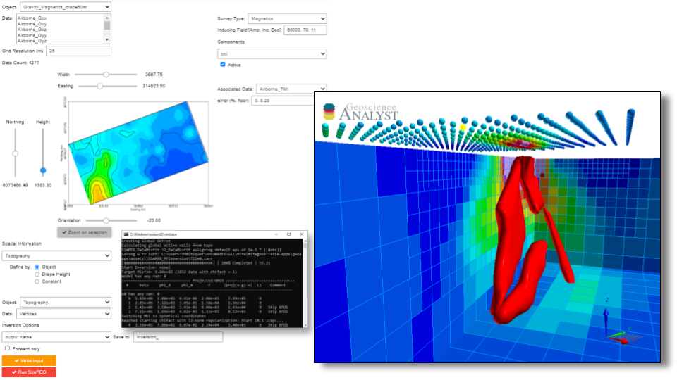

:orphan:

.. _inversionApp:

Geophysical inversion (SimPEG)
==============================

This application provides an interface to geophysical inversion using the `SimPEG <https://simpeg.xyz/>`_ open-source algorithms. The application currently supports

 - Electromagnetic (time or frequency) data using a Laterally Constrained 1D approach
 - Gravity and magnetics (field and/or tensor) data using an octree mesh tiling approach.

.. note:: For gravity and magnetics data, it is recommended to run the
          inversion from a solid-state drive, as
          sensitivities are stored in chunks and accessed in parallel using
          the `Dask <https://dask.org/>`_ library.

.. note:: Active widgets on this page are for demonstration only.

          The latest version of the application can be `downloaded here <https://github.com/MiraGeoscience/geoapps/archive/develop.zip>`_.

          See the :ref:`Installation page <getting_started>` to get started.

Input data
----------

Object and data fields selection
^^^^^^^^^^^^^^^^^^^^^^^^^^^^^^^^

List of objects with corresponding data and data groups.
The selected data are used to populate **2- Data Components**
See :ref:`Object, data selection <objectdataselection>`

.. jupyter-execute::
    :hide-code:

    from geoapps.selection import ObjectDataSelection
    ObjectDataSelection(
    select_multiple=True, add_groups=True,
         h5file=r"../assets/FlinFlon.geoh5",
         objects="Data_FEM_pseudo3D",
    ).widget

Windowing and downsampling
^^^^^^^^^^^^^^^^^^^^^^^^^^

See :ref:`Plot and select data <plotselectiondata>`

.. jupyter-execute::
            :hide-code:

            from geoapps.plotting import PlotSelection2D
            app = PlotSelection2D(
              h5file=r"../assets/FlinFlon.geoh5",
            )
            app.widget

Data channels options
---------------------

Survey Type
^^^^^^^^^^^

List of available survey types.
The application will attempt to assign the *Survey Type* based on
known *Groups/Data* fields (e.g. *CPI* => *DIGHEM*).

.. jupyter-execute::
    :hide-code:

    from geoapps.utils import geophysical_systems
    from ipywidgets.widgets import Dropdown
    Dropdown(
      options=["Magnetics", "Gravity"] + list(geophysical_systems.parameters().keys()),
      description="Survey Type: ",
    )

Inducing field parameters
^^^^^^^^^^^^^^^^^^^^^^^^^

**(Magnetics only)** Set the inducing field parameters in [Amplitude (nT), Inclination (dd.dd), Declination (dd.dd)]

.. jupyter-execute::
    :hide-code:

    from ipywidgets.widgets import Text
    Text(
      description="Inducing Field [Amp, Inc, Dec]",
      value="60000, 79, 11"
    )

Activate
^^^^^^^^

Checked if the channel is to be used in the inversion

.. jupyter-execute::
    :hide-code:

    from geoapps.inversion import ChannelOptions
    app = ChannelOptions("DIGHEM", "Frequency (Hz)")
    app.active.value=True
    app.active

Frequency/time components
^^^^^^^^^^^^^^^^^^^^^^^^^

 **(EM only)** List of expected frequency or time channels from the selected system type.

.. jupyter-execute::
    :hide-code:

    from geoapps.inversion import ChannelOptions
    app = ChannelOptions("DIGHEM", "Frequency (Hz)")
    app.label.value = "900"
    app.label

Data Channel
^^^^^^^^^^^^

Data channel associated with the selected component.

.. jupyter-execute::
    :hide-code:

    from geoapps.inversion import ChannelOptions
    app = ChannelOptions("DIGHEM", "Frequency (Hz)")
    app.channel_selection.options = ["CPI56k", "CPI7000", "CPI900", "CPQ56k", "CPQ7000", "CPQ900"]
    app.channel_selection.value  = "CPI900"
    app.channel_selection

.. _uncertainties:

Error (%, floor)
^^^^^^^^^^^^^^^^

Estimated data uncertainties associated with the data channel, expressed as a
percent and floor value such that: 0.1, 1 => :math:`0.1 \times |data| + 1`

.. jupyter-execute::
    :hide-code:

    from geoapps.inversion import ChannelOptions
    app = ChannelOptions("DIGHEM", "Frequency (Hz)")
    app.uncertainties.value="0, 4"
    app.uncertainties

Offsets
^^^^^^^

**(EM only)**: Offsets (m) between the receiver with respect to the transmitter center location.

.. jupyter-execute::
    :hide-code:

    from geoapps.inversion import ChannelOptions
    app = ChannelOptions("DIGHEM", "Frequency (Hz)")
    app.offsets.value="8, 0, 0"
    app.offsets

Topography, Sensor and Line Location Options
--------------------------------------------

Topography
^^^^^^^^^^

Options to define the upper limit of the model (air/ground interface).

.. jupyter-execute::
    :hide-code:

    Dropdown(
      options=["Topography", "Receivers", "Line ID (EM)"],
    )

Object and data
"""""""""""""""

Topography defined by an object x,y location and data z-data value.

.. jupyter-execute::
    :hide-code:

    from geoapps.inversion import TopographyOptions
    app = TopographyOptions(
        h5file=r"../assets/FlinFlon.geoh5",
        objects="Topography", value="Vertices"
    )
    app.options.value="Object"
    app.options.disabled=True
    app.widget

Relative to sensor
""""""""""""""""""

Topography defined by the ``Receiver`` [x, y, z] locations and z-drape value
(-below), also known as draped survey.

.. jupyter-execute::
    :hide-code:

    from geoapps.inversion import TopographyOptions
    app = TopographyOptions(
        h5file=r"../assets/FlinFlon.geoh5",
        objects="Topography", value="Vertices"
    )
    app.options.value="Relative to Sensor"
    app.options.disabled=True
    app.offset.value = -40
    app.widget

Constant
""""""""

Topography defined at constant elevation (m).

.. jupyter-execute::
    :hide-code:

    from geoapps.inversion import TopographyOptions
    app = TopographyOptions(
        h5file=r"../assets/FlinFlon.geoh5",
        objects="Topography", value="Vertices"
    )
    app.options.value="Constant"
    app.options.disabled=True
    app.widget

Sensors
^^^^^^^
Defines the sensor position in 3D space.

Sensor location
"""""""""""""""

Sensor position defined by a constant offset from the vertices of the selected
object. Typically used for towed system where the GPS receiver is on the
aircraft.

.. jupyter-execute::
    :hide-code:

    from geoapps.inversion import SensorOptions
    h5file = r"../assets/FlinFlon.geoh5"
    app = SensorOptions(h5file=h5file, objects="Data_FEM_pseudo3D")
    app.options.value="sensor location + (dx, dy, dz)"
    app.options.disabled=True
    app.widget

Topo and radar
""""""""""""""

Receiver locations defined by the vertices horizontal positions [x, y] and z value
interpolated from topography + clearance height. Typically used for gridded
data with constant draped height or for airborne survey with inaccurate GPS
elevation (radar height).

.. jupyter-execute::
    :hide-code:

    from geoapps.inversion import SensorOptions
    h5file = r"../assets/FlinFlon.geoh5"
    app = SensorOptions(h5file=h5file, objects="Data_FEM_pseudo3D")
    app.options.value="topo + radar + (dx, dy, dz)"
    app.data.options = list(app.data.options) + ["radar"]
    app.data.value = 'radar'
    app.options.disabled=True
    app.widget

Line ID
^^^^^^^

**(EM only)**: Data channel and selected line number to be inverted.

.. jupyter-execute::
    :hide-code:

    from geoapps.inversion import LineOptions
    h5file = r"../assets/FlinFlon.geoh5"
    app = LineOptions(h5file=h5file, objects="Data_FEM_pseudo3D")
    app.widget

Inversion Options
-----------------

List of parameters controlling the inversion.

.. jupyter-execute::
    :hide-code:

    from geoapps.inversion import InversionOptions
    h5file = r"../assets/FlinFlon.geoh5"
    widgets = InversionOptions(h5file=h5file)
    widgets.option_choices

Output name
^^^^^^^^^^^

Name given to the inversion group added to the ANALYST project.

.. jupyter-execute::
    :hide-code:

    from geoapps.inversion import InversionOptions
    h5file = r"../assets/FlinFlon.geoh5"
    widgets = InversionOptions(h5file=h5file)
    widgets.output_name

Target misfit
^^^^^^^^^^^^^

Target data misfit where 1 = number of data

.. jupyter-execute::
    :hide-code:

    from geoapps.inversion import InversionOptions
    h5file = r"../assets/FlinFlon.geoh5"
    widgets = InversionOptions(h5file=h5file)
    widgets.chi_factor

Uncertainty mode
^^^^^^^^^^^^^^^^

Global changes to the data uncertainties

.. jupyter-execute::
     :hide-code:

     from geoapps.inversion import InversionOptions
     h5file = r"../assets/FlinFlon.geoh5"
     widgets = InversionOptions(h5file=h5file)
     widgets.uncert_mode

Estimated
"""""""""
Calculate uncertainty floor values based on the fields of the reference model.

User Input
""""""""""
Apply uncertainties as set in ref:`assigned uncertainties <uncertainties>`

Starting model
^^^^^^^^^^^^^^

Initial model used to begin the inversion.

.. jupyter-execute::
    :hide-code:

    from geoapps.inversion import InversionOptions
    h5file = r"../assets/FlinFlon.geoh5"
    widgets = InversionOptions(h5file=h5file)
    widgets.starting_model.options.value = "Model"
    widgets.starting_model.options.disabled = True
    widgets.starting_model.objects.value = "O2O_Interp_25m"
    widgets.starting_model.data.value = "VTEM_model"
    widgets.starting_model.widget

Object and values
"""""""""""""""""

Model object and values selected from any Surface, BlockModel or Octree object
Values are interpolated onto the inversion mesh using a nearest neighbor
algorithm.

.. jupyter-execute::
    :hide-code:

    from geoapps.inversion import InversionOptions
    h5file = r"../assets/FlinFlon.geoh5"
    widgets = InversionOptions(h5file=h5file)
    widgets.starting_model.options.value = "Value"
    widgets.starting_model.value.value = 1e-4
    widgets.starting_model.options.disabled = True
    widgets.starting_model.widget

Constant
""""""""

Constant background half-space value.

Susceptibility model *(FEM Only)*
^^^^^^^^^^^^^^^^^^^^^^^^^^^^^^^^^

Susceptibility values used in the forward calculations only.

Object and values
"""""""""""""""""

Model values selected from any ``Surface``, ``BlockModel`` or ``Octree`` object Values are
interpolated onto the inversion mesh using a nearest neighbor algorithm.

.. jupyter-execute::
    :hide-code:

    from geoapps.inversion import InversionOptions
    h5file = r"../assets/FlinFlon.geoh5"
    widgets = InversionOptions(h5file=h5file)
    widgets.susceptibility_model.options.value = "Model"
    widgets.susceptibility_model.options.disabled = True
    widgets.susceptibility_model.objects.value = "O2O_Interp_25m"
    widgets.susceptibility_model.data.value = "VTEM_model"
    widgets.susceptibility_model.widget

Constant
""""""""

Constant background susceptibility value (SI).

.. jupyter-execute::
    :hide-code:

    from geoapps.inversion import InversionOptions
    h5file = r"../assets/FlinFlon.geoh5"
    widgets = InversionOptions(h5file=h5file)
    widgets.susceptibility_model.options.value = "Value"
    widgets.susceptibility_model.value.value = 1e-4
    widgets.susceptibility_model.options.disabled = True
    widgets.susceptibility_model.widget

Regularization
--------------

Parameters controlling the regularization function.

Reference model
^^^^^^^^^^^^^^^

Reference model used in the `objective function <https://giftoolscookbook.readthedocs.io/en/latest/content/fundamentals/ObjectiveFunction.html#the-objective-function>`_.

.. jupyter-execute::
    :hide-code:

    from geoapps.inversion import InversionOptions
    h5file = r"../assets/FlinFlon.geoh5"
    widgets = InversionOptions(h5file=h5file)
    widgets.reference_model.options.value = "None"
    widgets.reference_model.options.disabled = True
    widgets.reference_model.widget

None
""""

**(Gravity/Magnetics only)** No reference value.

Best-fitting halfspace
""""""""""""""""""""""

*(EM only)* Run a preliminary inversion to determine a best-fitting halfspace
(single conductivity value) at each station

.. jupyter-execute::
    :hide-code:

    from geoapps.inversion import InversionOptions
    h5file = r"../assets/FlinFlon.geoh5"
    widgets = InversionOptions(h5file=h5file)
    widgets.reference_model.options.value = "Best-fitting halfspace"
    widgets.reference_model.options.disabled = True
    widgets.reference_model.widget

Object and values
"""""""""""""""""

Model values selected from any ``Surface``, ``BlockModel`` or ``Octree`` object Values are
interpolated onto the inversion mesh using a nearest neighbor algorithm.

.. jupyter-execute::
    :hide-code:

    from geoapps.inversion import InversionOptions
    h5file = r"../assets/FlinFlon.geoh5"
    widgets = InversionOptions(h5file=h5file)
    widgets.reference_model.options.value = "Model"
    widgets.reference_model.options.disabled = True
    widgets.reference_model.objects.value = "O2O_Interp_25m"
    widgets.reference_model.data.value = "VTEM_model"
    widgets.reference_model.widget

Constant
""""""""

Constant half-space value

.. jupyter-execute::
    :hide-code:

    from geoapps.inversion import InversionOptions
    h5file = r"../assets/FlinFlon.geoh5"
    widgets = InversionOptions(h5file=h5file)
    widgets.reference_model.options.value = "Value"
    widgets.reference_model.options.disabled = True
    widgets.reference_model.value.value = "1e-4"
    widgets.reference_model.widget

:math:`\alpha`-Scaling
^^^^^^^^^^^^^^^^^^^^^^

Scaling between the components of the regularization function.

.. jupyter-execute::
      :hide-code:

      from geoapps.inversion import InversionOptions
      h5file = r"../assets/FlinFlon.geoh5"
      widgets = InversionOptions(h5file=h5file)
      widgets.alphas

:math:`l_p`-norms
^^^^^^^^^^^^^^^^^

Norms applied to the components of the regularization :math:`p_s, p_x, p_y,
p_z` (see `Sparse and Blocky Norms <https://giftoolscookbook.readthedocs.io/en/latest/content/fundamentals/Norms.html#sparse-and-blocky-norms>`_)

.. jupyter-execute::
      :hide-code:

      from geoapps.inversion import InversionOptions
      h5file = r"../assets/FlinFlon.geoh5"
      widgets = InversionOptions(h5file=h5file)
      widgets.norms

Mesh parameters
---------------

Define the grid representing the physical property model.

Octree mesh (Gravity/Magnetics)
^^^^^^^^^^^^^^^^^^^^^^^^^^^^^^^

An octree mesh is defined by a tree structure such that cells are subdivided
it into smaller cells in eight octants. The following parameters allow to
control the extent size and rules of cells refinement.

Smallest cells
""""""""""""""

Dimensions (x,y,z) of the smallest octree cells.

.. jupyter-execute::
    :hide-code:

    from geoapps.inversion import MeshOctreeOptions
    widgets = MeshOctreeOptions()
    widgets.core_cell_size

Layers below topography
"""""""""""""""""""""""

Number of layers of cells at each octree level below the topography surface.
As topography generally extends further, it is common practice to use only
coarse cells once outside of the survey area.

.. jupyter-execute::
    :hide-code:

    from geoapps.inversion import MeshOctreeOptions
    widgets = MeshOctreeOptions()
    widgets.octree_levels_topo

Layers below data
"""""""""""""""""

Number of layers of cells at each octree level below the observation points.

.. jupyter-execute::
    :hide-code:

    from geoapps.inversion import MeshOctreeOptions
    widgets = MeshOctreeOptions()
    widgets.octree_levels_obs

.. _min_depth:

Minimum depth (m)
"""""""""""""""""

Minimum depth (m) of the mesh, rounded up to the next power of 2.

.. jupyter-execute::
    :hide-code:

    from geoapps.inversion import MeshOctreeOptions
    widgets = MeshOctreeOptions()
    widgets.depth_core

Padding [W,E,N,S,D,U] (m)
"""""""""""""""""""""""""

Additional padding distance (m) along West, East, North, South, Down and Up,
chosen by default to be half of the data extent in each direction. Additional
padding can be added at depth, but it is recommended to set it through the
:ref:`Minimum depth <min_depth>` parameter.

.. jupyter-execute::
    :hide-code:

    from geoapps.inversion import MeshOctreeOptions
    widgets = MeshOctreeOptions()
    widgets.padding_distance

Max triangulation length
""""""""""""""""""""""""

Parameter controlling the Delaunay triangulation used for the refinement of
the mesh around topography and observation points. Large triangles generated
between points far apart are filtered out, reducing the number of small cells
in regions without data.

.. jupyter-execute::
    :hide-code:

    from geoapps.inversion import MeshOctreeOptions
    widgets = MeshOctreeOptions()
    widgets.max_distance

Bounds
^^^^^^

Upper and lower bound constraints applied on physical property model.
Open bounds if left empty [-inf, inf].

.. jupyter-execute::
    :hide-code:

    from geoapps.inversion import InversionOptions
    h5file = r"../assets/FlinFlon.geoh5"
    widgets = InversionOptions(h5file=h5file)
    widgets.lower_bound.value = "1e-5"
    widgets.upper_bound.value = "1e-1"
    widgets.inversion_options["upper-lower bounds"]

Ignore values
^^^^^^^^^^^^^

.. jupyter-execute::
    :hide-code:

    from geoapps.inversion import InversionOptions
    h5file = r"../assets/FlinFlon.geoh5"
    widgets = InversionOptions(h5file=h5file)
    widgets.ignore_values

Data
""""

Ignore data points with dummy values OR outside a threshold value.
e.g. "<0" will ignore all negative data values.

Air cells
"""""""""

Fill values used to populate the model above ground (air cells)

Optimization
^^^^^^^^^^^^

Max beta Iterations
"""""""""""""""""""

Maximum number of :math:`\beta`-iterations allowed.
Note that when applying sparse norms, the inversion may require >20 iterations to converge.

.. jupyter-execute::
    :hide-code:

    from geoapps.inversion import InversionOptions
    h5file = r"../assets/FlinFlon.geoh5"
    widgets = InversionOptions(h5file=h5file)
    widgets.max_iterations

Target misfit
"""""""""""""

Target data misfit where :math:`\chi=1` corresponds to :math:`\phi_d=N`
(number of data). (See `Data Misfit and Uncertainties <https://giftoolscookbook.readthedocs.io/en/latest/content/fundamentals/Uncertainties.html#data-misfit-and-uncertainties>`_)

.. jupyter-execute::
    :hide-code:

    from geoapps.inversion import InversionOptions
    h5file = r"../assets/FlinFlon.geoh5"
    widgets = InversionOptions(h5file=h5file)
    widgets.chi_factor
