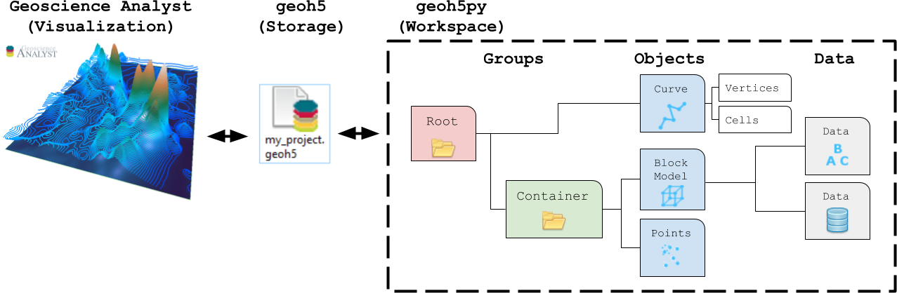

User Guide
==========

This section provides information on how to use the **mirageoscience-apps** package, from
the creation of application to the usage of existing ones.

.. toctree::
   :maxdepth: 2

   ./../_examples/Automated_Lineament.ipynb
   ./../_examples/Coordinate_Transformation.ipynb
   ./../_examples/Create_contours.ipynb
   ./../_examples/Export_to.ipynb
   ./../_examples/Geophysical_Inversion_app.ipynb
   ./../_examples/Grav_Mag_Block_Simulation.ipynb
   ./../_examples/Object_to_object_interpolation.ipynb
