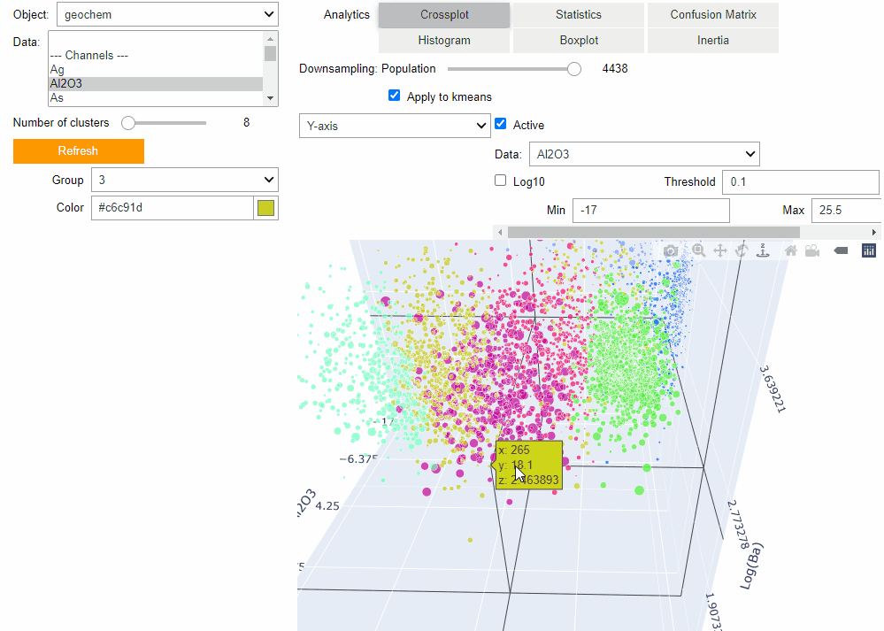
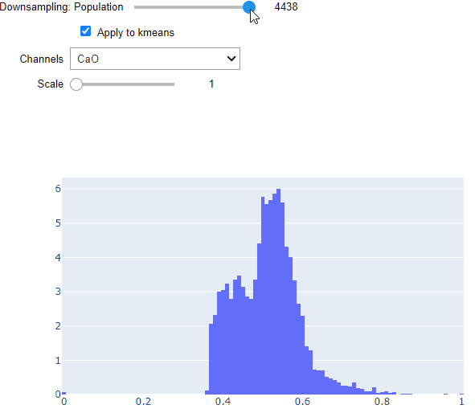

KMeans Clustering
*****************

This application lets users cluster data stored on `Geoscience ANALYST <https://mirageoscience.com/mining-industry-software/geoscience-analyst/>`_
objects using the `Scikit-Learn KMeans <https://scikit-learn.org/stable/modules/generated/sklearn.cluster.KMeans.html?highlight=kmeans#sklearn.cluster.KMeans>`_
clustering algorithm. Leveraging `Plotly <https://plotly.com/>`_ visualization tools, users are able to assess the clustering
results using histogram, box, scatter, inertia and cross-correlation plots.

.. note:: Active widgets on this page are for demonstration only.

          The latest version of the application can be `downloaded here <https://github.com/MiraGeoscience/geoapps/archive/develop.zip>`_.

          See the :ref:`Installation page <getting_started>` to get started.

Workspace
---------

Select a ``geoh5`` file containing dat.

See :ref:`Workspace selection <workspaceselection>`

.. jupyter-execute::
    :hide-code:

    from geoapps.processing import Clustering
    app = Clustering(
        h5file=r"../assets/FlinFlon_light.geoh5",
        static=True
    )
    app.project_panel

Input data
----------

List of objects with corresponding data and data groups to be used in the clustering.

See :ref:`Object, Data Selection <objectdataselection>`

.. jupyter-execute::
    :hide-code:

    from geoapps.processing import Clustering
    from ipywidgets import HBox
    app = Clustering(
          h5file=r"../assets/FlinFlon_light.geoh5",
          static=True
    )
    HBox([app.objects, app.data])

Clustering
----------

Chose the number of clusters (groups). By default, the application will run
KMeans for 2, 4, 8, 16 and 32 groups in order to draw a meaningful :ref:`Inertia Curve <inertia_curve>`

.. jupyter-execute::
    :hide-code:

        from geoapps.processing import Clustering
        from ipywidgets import VBox
        app = Clustering(
              h5file=r"../assets/FlinFlon_light.geoh5",
              static=True
        )
        VBox([app.n_clusters, app.refresh_clusters,])

**Refresh**

Re-run the clustering after changing the list of input data or :ref:`downsampling <downsampling>`.

Groups Color
^^^^^^^^^^^^

Assign a specific color to a given cluster group.

.. jupyter-execute::
    :hide-code:

    from geoapps.processing import Clustering
    import plotly.offline as py
    from ipywidgets import VBox

    app = Clustering(
          h5file=r"../assets/FlinFlon_light.geoh5",
          static=True
    )
    VBox([
      app.groups_options,
      app.color_pickers[app.groups_options.value]
    ])

Analytics
---------

Plotting options to analyze the KMeans clustering.

.. jupyter-execute::
    :hide-code:

    from geoapps.processing import Clustering
    app = Clustering(
          h5file=r"../assets/FlinFlon_light.geoh5",
          static=True
    )
    app.plotting_options

Crossplot
^^^^^^^^^

See :ref:`Scatter Plot <scatter_plot>`

The color values displayed correspond to the cluster groups.

.. jupyter-execute::
    :hide-code:

    from geoapps.processing import Clustering
    from ipywidgets import HBox, VBox

    import plotly.offline as py

    app = Clustering(
          h5file=r"../assets/FlinFlon_light.geoh5",
          static=True
    )
    display(VBox([
      app.axes_options
      ])
      )
    py.iplot(app.crossplot_fig)

.. _downsampling:

Downsampling
^^^^^^^^^^^^

Reduce the number of data points displayed on the scatter plot for efficiency.
Data points are selected based on the random sampling of the combined Probability
Density Function (PDF) of all fields.

.. jupyter-execute::
    :hide-code:

    from geoapps.processing import Clustering
    from ipywidgets import HBox, VBox

    import plotly.offline as py

    app = Clustering(
          h5file=r"../assets/FlinFlon_light.geoh5",
          static=True
    )
    display(VBox([
      HBox([app.downsampling, app._downsample_clustering]),
      ])
      )

**Apply to kmeans**
"""""""""""""""""""

Optionally, downsampling can also be applied to the
kmeans algorithm for speedup. Data points omitted by the algorithm are
assigned to a group in post-processing using a nearest neighbor interpolation.

.. warning:: Results may change significantly when combining a large number of
             clusters with a small sampling population. It is recommended to use the complete dataset
             as a final product.

Statistics
^^^^^^^^^^

Display data statistics using the `pandas.DataFrame.describe <https://pandas.pydata.org/pandas-docs/stable/reference/api/pandas.DataFrame.describe.html>`_ function.

.. jupyter-execute::
    :hide-code:

    from geoapps.processing import Clustering
    import plotly.offline as py

    app = Clustering(
          h5file=r"../assets/FlinFlon_light.geoh5",
          static=True
    )

    display(
        app.dataframe.describe(percentiles=None, include=None, exclude=None)
    )

Confusion Matrix
^^^^^^^^^^^^^^^^

Display the confusion matrix for the chosen data fields used by the kmeans.

.. jupyter-execute::
    :hide-code:

    from geoapps.processing import Clustering
    import plotly.offline as py

    app = Clustering(
          h5file=r"../assets/FlinFlon_light.geoh5",
          static=True
    )
    app.plotting_options.value = "Confusion Matrix"
    py.iplot(app.heatmap_fig)

Histograms
^^^^^^^^^^

Display histograms for each data field. By default, data fields are normalized between [0, 1].

.. jupyter-execute::
    :hide-code:

    from geoapps.processing import Clustering
    import plotly.offline as py
    from ipywidgets import VBox

    app = Clustering(
          h5file=r"../assets/FlinFlon_light.geoh5",
          static=True
    )
    app.plotting_options.value = "Histogram"
    app.make_hist_plot(None)
    field = app.channels_plot_options.value

    display(VBox([
      app.channels_plot_options,
      app.scalings[field]
    ]))
    py.iplot(app.histo_plots[field])

**Scale**
"""""""""

Option to increase the weight of a specific data field.

.. _inertia_curve:

Inertia
^^^^^^^

Display the clusters inertia, or sum squares of distances between each sample
to the center of its cluster group. The optimal number of clusters is
generally thought to be at the point of maximum curvature.

.. jupyter-execute::
    :hide-code:

    from geoapps.processing import Clustering
    import plotly.offline as py
    from ipywidgets import VBox

    app = Clustering(
          h5file=r"../assets/FlinFlon_light.geoh5",
          static=True
    )
    app.plotting_options.value = "Inertia"
    py.iplot(app.inertia_plot)

Boxplot
^^^^^^^

Display boxplots describing the range of values within each cluster for a chosen data field.

.. jupyter-execute::
    :hide-code:

    from geoapps.processing import Clustering
    import plotly.offline as py
    from ipywidgets import VBox

    app = Clustering(
          h5file=r"../assets/FlinFlon_light.geoh5",
          static=True
    )
    app.plotting_options.value = "Boxplot"
    app.make_box_plot(None)
    field = app.channels_plot_options.value
    display(app.channels_plot_options)
    py.iplot(app.box_plots[field])

Output
------

See :ref:`Trigger panel<trigger_panel>` base applications.

.. jupyter-execute::
    :hide-code:

    from geoapps.processing import Clustering
    app = Clustering(
        h5file=r"../assets/FlinFlon_light.geoh5",
        static=True
    )
    app.trigger_panel
