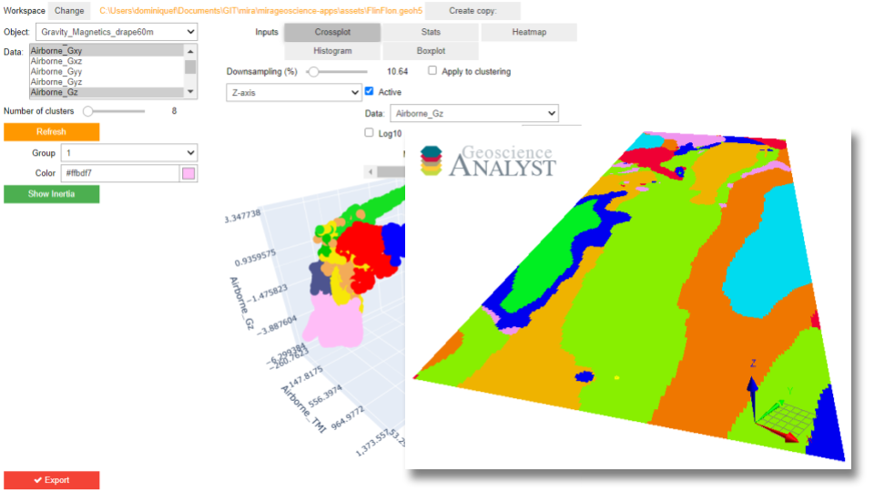

KMeans Clustering
*****************

This application lets users cluster data pulled from `Geoscience ANALYST <https://mirageoscience.com/mining-industry-software/geoscience-analyst/>`_
objects using the `Scikit-Learn KMeans <https://scikit-learn.org/stable/modules/generated/sklearn.cluster.KMeans.html?highlight=kmeans#sklearn.cluster.KMeans>`_
clustering algorithm. In addition, users are able to assess the clustering
results using bar, scatter, inertia and cross-correlation plots.

Parameters
==========

List of interactive widgets making up the application.

.. note:: For demonstration purposes only.

          The latest version of the application can be `downloaded here <https://github.com/MiraGeoscience/geoapps/archive/develop.zip>`_.

          See the :ref:`Installation page <getting_started>` to get started.

Workspace
---------

Select a ``geoh5`` file containing dat.

See :ref:`Workspace selection <workspaceselection>`

.. jupyter-execute::
    :hide-code:

    from geoapps.processing import Clustering
    app = Clustering(
        h5file=r"../assets/FlinFlon.geoh5",
        static=True
    )
    app.project_panel

Input data
----------

List of objects with corresponding data and data groups to be used in the clustering.

See :ref:`Object, Data Selection <objectdataselection>`

.. jupyter-execute::
    :hide-code:

    from geoapps.processing import Clustering
    from ipywidgets import HBox
    app = Clustering(
          h5file=r"../assets/FlinFlon.geoh5",
          static=True
    )
    HBox([app.objects, app.data])

Clustering
----------

Chose the number of clusters (groups). By default, the application will run
KMeans for 2, 4, 8, 16 and 32 groups in order to draw a meaningful :ref:`Inertia Curve <inertia_curve>`

.. jupyter-execute::
    :hide-code:

        from geoapps.processing import Clustering
        from ipywidgets import HBox
        app = Clustering(
              h5file=r"../assets/FlinFlon.geoh5",
              static=True
        )
        HBox([app.objects, app.data])

Analytics
---------

Plotting options to analyze the KMeans clustering.

.. jupyter-execute::
    :hide-code:

    from geoapps.processing import Clustering
    app = Clustering(
          h5file=r"../assets/FlinFlon.geoh5",
          static=True
    )
    app.plotting_options

Crossplot
^^^^^^^^^

See :ref:`Scatter Plot <scatter_plot>`

The color values displayed correspond to the cluster groups.

.. jupyter-execute::
    :hide-code:

    from geoapps.processing import Clustering
    from ipywidgets import HBox, VBox

    import plotly.offline as py

    app = Clustering(
          h5file=r"../assets/FlinFlon.geoh5",
          static=True
    )
    display(VBox([
      app.axes_options
      ])
      )
    py.iplot(app.crossplot_fig)

.. jupyter-execute::
    :hide-code:

    from geoapps.processing import Clustering
    from ipywidgets import HBox, VBox

    import plotly.offline as py

    app = Clustering(
          h5file=r"../assets/FlinFlon.geoh5",
          static=True
    )
    display(VBox([
      HBox([app.downsampling, app._downsample_clustering]),
      ])
      )

Downsample the data displayed by the scatter plot for efficiency.
Data points (rows) are randomly sampled using `numpy.random.choice
<https://numpy.org/doc/stable/reference/random/generated/numpy.random.choice.html>`_,
and by an approximate Probability Density Function (PDF) calculated over all fields.

**Apply to clustering**: Optionally, downsampling can also be applied to the
kmeans algorithm for speedup. Data points omitted by the algorithm are
assigned to a group in post-processing using a nearest neighbor interpolation.

.. warning:: Results may change significantly depending on the chosen number of
          clusters and % downsampling.

Statistics
^^^^^^^^^^

Display data statistics using the `pandas.DataFrame.describe <https://pandas.pydata.org/pandas-docs/stable/reference/api/pandas.DataFrame.describe.html>`_ function.

.. jupyter-execute::
    :hide-code:

    from geoapps.processing import Clustering
    import plotly.offline as py

    app = Clustering(
          h5file=r"../assets/FlinFlon.geoh5",
          static=True
    )

    display(
        app.dataframe.describe(percentiles=None, include=None, exclude=None)
    )

Heatmap
^^^^^^^

Display the confusion matrix for the chosen data fields used by the kmeans.

.. jupyter-execute::
    :hide-code:

    from geoapps.processing import Clustering
    import plotly.offline as py

    app = Clustering(
          h5file=r"../assets/FlinFlon.geoh5",
          static=True
    )
    app.plotting_options.value = "Confusion Matrix"
    py.iplot(app.heatmap_fig)

Histograms
^^^^^^^^^^

Display histograms for each data field. By default, data fields are normalized between [0, 1].

**Scale**: Option to increase the weight of a data field.

.. jupyter-execute::
    :hide-code:

    from geoapps.processing import Clustering
    import plotly.offline as py
    from ipywidgets import VBox

    app = Clustering(
          h5file=r"../assets/FlinFlon.geoh5",
          static=True
    )
    app.plotting_options.value = "Histogram"
    app.make_hist_plot(None)
    field = app.channels_plot_options.value

    display(VBox([
      app.channels_plot_options,
      app.scaling_dict[field]
    ]))
    py.iplot(app.histoplot_dict[field])

.. _inertia_curve:

Inertia
^^^^^^^
