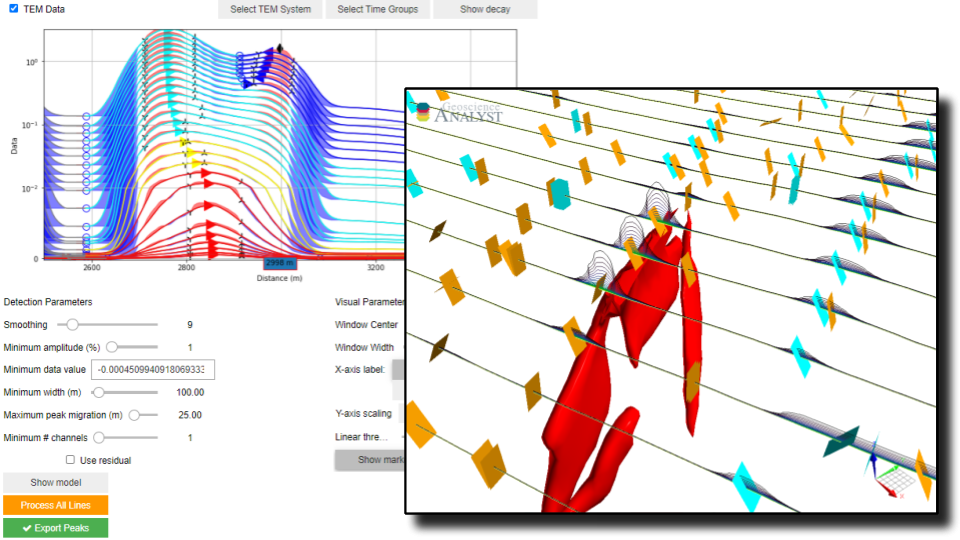

Peak Finder
***********

This search algorithm has been designed for the detection and grouping of time-domain electromagnetic (TEM) data anomalies measured along
flight lines.
Anomalies are identified from the detection of maximum, minimum and inflection points, calculated from the first and second order
derivatives of individual time profiles.
:ref:`Detection parameters <detection>` are available for filtering and grouping of co-located anomalies.
Manual adjustement of these parameters can first be done on a windowed portion of selected lines. Selected parameters
are then applied to all lines using `Dask <https://dask.org/>`_ parallel processes.
Group markers can be exported to Geoscience ANALYST, along with various metrics for characterization and targeting:

- Amplitude
- Dip direction
- Mad Tau (TEM data only)
- Anomaly skewness

The algorithm relies on the
`Numpy.fft <https://numpy.org/doc/stable/reference/routines.fft.html>`_ routine for the calculation of derivatives in
the Fourier domain. While initially designed for TEM data, the same application can be used to characterize anomalies
of mixed data types provided along curve objects (e.g. magnetics, gravity, dem, etc.).

.. note:: Active widgets on this page are for demonstration only.

          The latest version of the application can be `downloaded here <https://github.com/MiraGeoscience/geoapps/archive/develop.zip>`_.

          See the :ref:`Installation page <getting_started>` to get started.

Workspace
---------

Select a ``geoh5`` file containing dat.

See :ref:`Workspace selection <workspaceselection>`

.. jupyter-execute::
    :hide-code:

    from geoapps.processing import PeakFinder
    app = PeakFinder(
        h5file=r"../assets/FlinFlon_light.geoh5",
        static=True
    )
    app.project_panel

Input data
----------

Object and data
^^^^^^^^^^^^^^^
List of objects with corresponding data and data groups to be used by the search algorithm.

See :ref:`Object, Data Selection <objectdataselection>`

.. jupyter-execute::
    :hide-code:

    from geoapps.processing import PeakFinder
    from ipywidgets import VBox
    app = PeakFinder(
          h5file=r"../assets/FlinFlon_light.geoh5",
          static=True
    )
    VBox([app.objects, app.data, app.flip_sign])

**Invert Data**: (Optional) Multiply all selected data by -1.

Line Selection
^^^^^^^^^^^^^^

Selection of a channel representing the line identifier and specific line number.
The detection algorithm and filtering parameters are applied immediately to the selected line as a test dataset.

.. jupyter-execute::
    :hide-code:

        from geoapps.processing import PeakFinder
        from ipywidgets import VBox
        app = PeakFinder(
              h5file=r"../assets/FlinFlon_light.geoh5",
        )
        app.lines.widget

.. _peak_data:

Data Plot
---------

Line data plot with detected anomalies color coded by data groups. Minimum values (lows) are labeled with circles,
inflection points indicated with up/down ticks, and maximum (peak) values are labelled with arrows
pointing in the estimated dip direction determined by:

- (TEM data) the peak migration direction
- (None-TEM) the skew direction

(See diagram)

.. jupyter-execute::
    :hide-code:

        from geoapps.processing import PeakFinder
        from ipywidgets import VBox, Label
        app = PeakFinder(
              h5file=r"../assets/FlinFlon_light.geoh5",
        )
        app.plot_data_selection(
                app.lines.lines.value,
                app.smoothing.value,
                app.max_migration.value,
                app.min_channels.value,
                app.min_amplitude.value,
                app.min_value.value,
                app.min_width.value,
                app.residual.value,
                app.markers.value,
                app.scale_button.value,
                app.scale_value.value,
                app.center.value,
                app.width.value,
                app.group_list.value,
                app.plot_trigger.value,
                app.x_label.value,
        )

Visual Parameters
^^^^^^^^^^^^^^^^^

Parameters controlling the :ref:`Data Plot <data_plot>` and test region.

.. jupyter-execute::
    :hide-code:

        from geoapps.processing import PeakFinder
        from ipywidgets import VBox
        app = PeakFinder(
              h5file=r"../assets/FlinFlon_light.geoh5",
        )
        VBox([
            app.center,
            app.width,
            app.x_label,
            app.scale_panel,
            app.scale_button,
            app.markers,
        ])

*Center*: Position of the plotting window along the selected line.

*Width*: Width of the plotting window

*X-axis label*: Units displayed along the x-axis

*Y-axis scaling*: Normalization of the data displayed along the Y-axis

*Symlog*: Symmetric logarithmic option such that both positive and negative data can be displayed in log space.

*Linear Threshold*: Absolute value around which the symlog plot becomes linear (zero cross-over)

.. _detection:

Detection Parameters
^^^^^^^^^^^^^^^^^^^^

Parameters controlling the filtering and grouping of positive peak anomalies.

.. math::
    m_A = |\frac{d_{max} - d_{min}}{d_{min}}| * 100

.. jupyter-execute::
    :hide-code:

        from geoapps.processing import PeakFinder
        from ipywidgets import VBox
        app = PeakFinder(
              h5file=r"../assets/FlinFlon_light.geoh5",
        )
        VBox([
            app.smoothing,
            app.min_amplitude,
            app.min_value,
            app.min_width,
            app.max_migration,
            app.min_channels,
            app.residual,
        ])

*Smoothing*: Parameter controlling the sample width of a running mean averaging. Useful to smooth out noisy data.

*Minimum Amplitude*: Threshold value for filtering small anomalies, set as a percent (%) of the data anomaly over its minimum value.

*Minimum Data Value*: Minimum absolute data value used by the algorithm

*Minimum Width (m)*: Threshold short anomalies based on the along line length from start to end (consecutive lows).

*Maximum Peak Migration*: Threshold applied on the grouping of anomalies based on the lateral shift of peaks.

*Minimum number of channels*: Minimum number of data channels required to form a group.

*Use residual*: Option to use the residual between the recorded and smoothed data. Useful to highlight smaller anomalies within larger trends.

Output
------

See :ref:`Trigger panel<trigger_panel>` base applications.

.. jupyter-execute::
    :hide-code:

    from geoapps.processing import Clustering
    app = Clustering(
        h5file=r"../assets/FlinFlon_light.geoh5",
        static=True
    )
    app.trigger_panel
