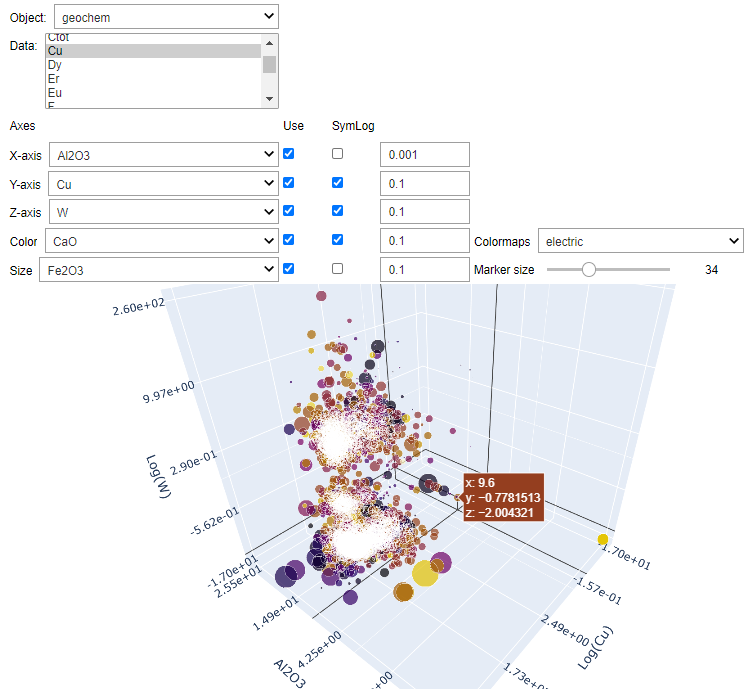

Scatter Plots
=============

This application lets users visualize up to 5D of data pulled from any <https://mirageoscience.com/mining-industry-software/geoscience-analyst/>`_ objects. The application uses the rich `Plotly <https://plotly.com/>`_ graphical interface and allows to:

- Easily flip between 2D and 3D cross-plots.
- Plot positive and negative values in log scale (symmetric-log)
- Change the color and size of markers based on property values
- Zoom, pan, rotate and export figures.

.. `Video tutorial available on Youtube <https://youtu.be/sjaQzZlm8qQ>`_

Input data
----------

.. list-table::
   :header-rows: 0

   * - .. jupyter-execute::
            :hide-code:

            from geoapps.plotting import ScatterPlots
            ScatterPlots(
                h5file=r"../assets/FlinFlon.geoh5"
            ).selection
   * - See :ref:`Object, data selection <objectdataselection>`
