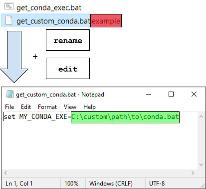

Getting Started
===============

Whether you are developer or an end-user, this page will help you get started with the **geoapps**.

Installation
------------

Install Conda
~~~~~~~~~~~~~

Install Conda for Python 3.9 or higher. Follow this link to download its Windows installer (~140 MB of disk space):

`Miniforge <https://github.com/conda-forge/miniforge#download>`_ `(Windows x86_64) <https://github.com/conda-forge/miniforge/releases/latest/download/Miniforge3-Windows-x86_64.exe>`_

Registering the Conda distribution as the default Python 3.10 interpreter is totally optional.
Preferably uncheck that box if you already have Python 3 installed on your system.

.. note:: We recommend installing **Miniforge**: beyond being smaller,
    it also installs packages from the conda-forge repository by default,
    which has no restriction for commercial use, while both Miniconda and Anaconda distributions use the Anaconda repository by default: see `Anaconda Terms of Service <https://www.anaconda.com/terms-of-service>`_ for details.
    In any case, the installation of **geoapps** forces the usage of the conda-forge repository,
    and is thus not affected by the Anaconda Terms of Service.

Download the latest geoapps
~~~~~~~~~~~~~~~~~~~~~~~~~~~

Follow this link to `download from the GitHub repository <https://github.com/MiraGeoscience/geoapps/archive/main.zip>`_.

Extract the package to your drive (SSD if available)
~~~~~~~~~~~~~~~~~~~~~~~~~~~~~~~~~~~~~~~~~~~~~~~~~~~~

Extract the package to your drive, preferably an SSD if available.

Run ``Install_or_Update.bat``
~~~~~~~~~~~~~~~~~~~~~~~~~~~~~

The same batch file can be used to install or update **geoapps**.
A conda environment named ``geoapps`` will be created to prevent conflicts with other software that may rely on Python.

.. figure:: ../images/run_install.png
    :align: center
    :width: 50%

.. note:: The assumption is made that Conda has been installed in one
   of the default directories, depending on the distribution
   (miniforge3, mambaforge, miniconda3, anaconda3):

   - %LOCALAPPDATA%\\
   - %USERPROFILE%\\
   - %LOCALAPPDATA%\\Continuum\\
   - %PROGRAMDATA%\\

If Conda gets installed in a different directory, users will need to add/edit a
``get_custom_conda.bat`` file to add their custom path to the ``conda.bat`` file:

Running the applications
------------------------
At this point, you will have all required packages to run the applications:

Run ``Start_Applications.bat``

.. figure:: ../images/run_applications.png
    :align: center
    :width: 50%

You should see the index page displayed in your default browser.

.. figure:: ../images/index_page.png
    :align: center
    :width: 100%

.. note:: Applications run best with either Chrome or Firefox.

From PyPI
---------

The **geoapps** can also be installed directly from PyPI without its dependencies::

    $ pip install geoapps

To install the latest development version of **geoapps**, you can use ``pip`` with the
latest GitHub ``development`` branch::

    $ pip install git+https://github.com/MiraGeoscience/geoapps.git

To work with **geoapps** source code in development, install from GitHub::

    $ git clone --recursive https://github.com/MiraGeoscience/geoapps.git
    $ cd geoapps
    $ python setup.py install

.. note:: The Jupyter-Notebook applications can be `downloaded from source <https://github.com/MiraGeoscience/geoapps/archive/develop.zip>`_ :

    .. figure:: ../images/download.png
        :align: center
        :width: 200
