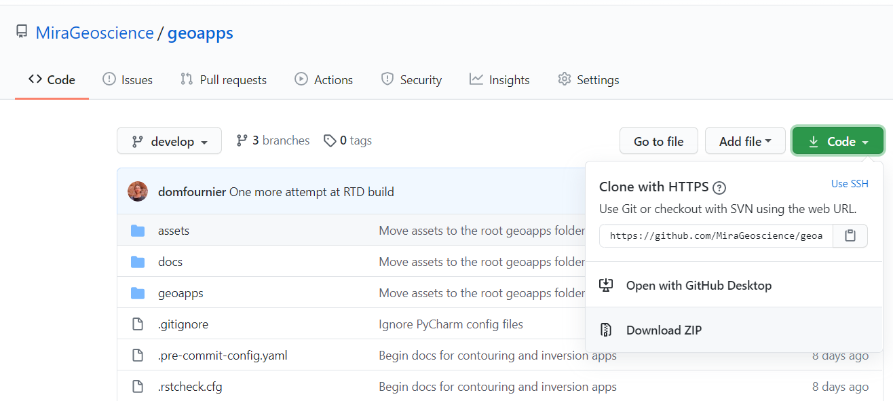

Getting Started
===============

Whether you are developer or an end-user, this page will help you get started with the **geoapps**.

Installation
------------

1- Install Conda for Python 3.7 or higher

Three recommended options:

- `Miniforge <https://github.com/conda-forge/miniforge#download>`_: ~140 MB of disk space
- `Miniconda <https://docs.conda.io/en/latest/miniconda.html#latest-miniconda-installer-links>`_: ~400 MB of disk space
- `Anaconda <https://www.anaconda.com/download/>`_: ~3 GB of disk space

Both miniconda and anaconda installation are using the Anaconda package repository by default,
which has some restrictions on commercial use. See `Anaconda Terms of Service <https://www.anaconda.com/terms-of-service>`_ for details.
The installation of **geoapps** forces the usage of the conda-forge repository, and is thus not affected by the Anaconda Terms of Service.

We recommend installing **Miniforge** with support for **Mamba** as:

- Miniforge installation is smaller
- Mamba is faster than conda to resolve package dependencies
- Miniforge installs package by default from the conda-forge repository which has no restriction for commercial use,
  contrary to the Anaconda repository.

Direct download link for Windows: `Mambaforge Windows x86_64 <https://github.com/conda-forge/miniforge/releases/latest/download/Mambaforge-Windows-x86_64.exe>`_

.. figure:: ../images/Mambaforge_Setup-1.png
    :align: center
    :width: 200

.. figure:: ../images/Mambaforge_Setup-2.png
    :align: center
    :width: 200

2- `Download the latest <https://github.com/MiraGeoscience/geoapps/archive/main.zip>`_ **geoapps** directory.

3- Extract the package to your drive (SSD if available).

.. figure:: ../images/extract.png
    :align: center
    :width: 50%

4- Run ``Install_Update.bat`` **(see notes below)**.

The same batch file can be used to update the package dependencies.
A conda environment named ``geoapps`` will be created to prevent conflicts with other software that may rely on Python.

.. note:: The assumption is made that Conda has been installed in one
   of the default directories:

- %LOCALAPPDATA%\\mamba[mini]forge\\
- %USERPROFILE%\\mamba[mini]forge\\
- %LOCALAPPDATA%\\ana[mini]conda3\\
- %USERPROFILE%\\ana[mini]conda3\\
- %LOCALAPPDATA%\\Continuum\\ana[mini]conda3\\
- C:\\ProgramData\\ana[mini]conda3\\

If Conda gets installed in a different directory, users will need to add/edit a
``get_custom_conda.bat`` file to add their custom path to the ``conda.bat`` file:

.. figure:: ../images/Install_start_bat.png
    :align: center
    :width: 75%

Running the applications
------------------------
At this point, you will have all required packages to run the applications:

Run ``Start_Applications.bat``

.. figure:: ../images/run_applications.png
    :align: center
    :width: 50%

You should see the index page displayed in your default browser.

.. figure:: ../images/index_page.png
    :align: center
    :width: 100%

.. note:: Applications run best with either Chrome or Firefox.

From PyPI
---------

The **geoapps** can also be installed directly from PyPI without its dependencies::

    $ pip install geoapps

To install the latest development version of **geoapps**, you can use ``pip`` with the
latest GitHub ``development`` branch::

    $ pip install git+https://github.com/MiraGeoscience/geoapps.git

To work with **geoapps** source code in development, install from GitHub::

    $ git clone --recursive https://github.com/MiraGeoscience/geoapps.git
    $ cd geoapps
    $ python setup.py install

.. note:: The Jupyter-Notebook applications can be `downloaded from source <https://github.com/MiraGeoscience/geoapps/archive/develop.zip>`_ :

