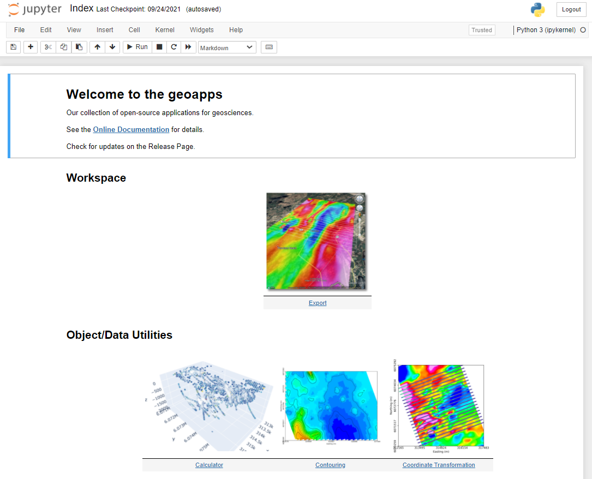

geoapps: Python applications for geoscientific problems
=======================================================

Welcome to **geoapps**! Where geoscientists meet to share open-source applications.

In short
^^^^^^^^

The **geoapps** has been created `Mira Geoscience <https://mirageoscience.com/>`_ for the development of open-source
geoscientific applications in Python. Users will be able to directly leverage
the powerful visualization capabilities of `Geoscience ANALYST
<https://mirageoscience.com/mining-industry-software/geoscience-analyst/>`_
along with open-source code from the Python ecosystem.

The Latest
^^^^^^^^^^

Release 0.2.5
"""""""""""""

- :ref:`Upper/lower bound values <kmeans_bounds>` added to the KMeans clustering application.
- Fix for documentation

Contents:
^^^^^^^^^

.. toctree::
   :maxdepth: 2

   content/installation.rst
   content/applications.rst
   content/howto.rst
   content/feedback.rst
